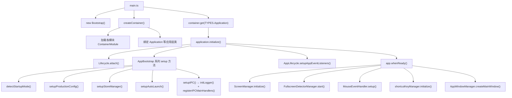

# 主进程架构总览

本文档描述 WallpaperBase Electron 主进程经过模块化重构后的整体架构，帮助开发者快速了解目录结构、模块规范和开发流程。

---

## 目录

1. [整体目录结构](#整体目录结构)
2. [启动流程](#启动流程)
3. [各层职责](#各层职责)
4. [模块规范](#模块规范)
5. [模块清单](#模块清单)
6. [WebSocket 模块专项说明](#websocket-模块专项说明)
7. [Logger 模块专项说明](#logger-模块专项说明)
8. [渲染进程架构概览](#渲染进程架构概览)
9. [共享层 src/shared](#共享层-srcshared)
10. [外部集成机制](#外部集成机制)
11. [新增模块指南](#新增模块指南)
12. [相关文档](#相关文档)

---

## 整体目录结构

```
src/
├── main/                          # Electron 主进程
│   ├── main.ts                    # 应用入口
│   ├── preload.ts                 # 预加载脚本
│   ├── container/                 # IoC 容器配置
│   │   ├── createContainer.ts     # 创建并配置容器
│   │   └── identifiers.ts         # TYPES 服务标识符
│   ├── core/                      # 核心接口定义
│   │   ├── IService.ts            # 服务生命周期基接口
│   │   └── interfaces/            # 各服务抽象接口
│   │       ├── IAppState.ts
│   │       ├── IAutoLaunchService.ts
│   │       ├── IDownloadService.ts
│   │       ├── IFaceBeautyService.ts
│   │       ├── IFullscreenService.ts
│   │       ├── IInterWindowService.ts
│   │       ├── INativeService.ts
│   │       ├── IRTCChatService.ts
│   │       ├── IScreenService.ts
│   │       ├── IShortcutService.ts
│   │       ├── IStoreService.ts
│   │       ├── ITrayService.ts
│   │       ├── IUEStateService.ts
│   │       ├── IWallpaperService.ts
│   │       ├── IWebSocketService.ts
│   │       └── IWindowService.ts
│   ├── app/                       # 应用编排层
│   │   ├── Application.ts         # IoC 入口应用（injectable）
│   │   ├── AppState.ts            # 全局应用状态（isDebug、isQuitting 等）
│   │   ├── AppBootstrap.ts        # 启动初始化
│   │   ├── AppLifecycle.ts        # 应用生命周期与清理
│   │   ├── AppWindowManager.ts    # 窗口编排
│   │   ├── Bootstrap.ts           # Squirrel/单实例处理
│   │   ├── Lifecycle.ts           # app 事件挂载
│   │   └── MouseEventHandler.ts   # 全局鼠标事件
│   ├── ipc-events/                # IPC 事件中心（MainIpcEvents 单例路由）
│   │   ├── MainIpcEvents.ts       # 主进程 IPC 中心路由器
│   │   ├── helpers.ts             # IPC 辅助函数
│   │   ├── index.ts
│   │   └── handler/               # 通用 IPC 处理器（非模块级）
│   │       ├── handlers.ts        # registerIPCMainHandlers() 统一入口
│   │       ├── assetValidationHandlers.ts
│   │       ├── fileHandlers.ts
│   │       ├── networkHandlers.ts
│   │       ├── pathHandlers.ts
│   │       └── systemHandlers.ts
│   ├── modules/                   # 功能模块（16 个，详见下文）
│   │   ├── autolaunch/
│   │   ├── download/
│   │   ├── face-beauty/
│   │   ├── fullscreen/
│   │   ├── logger/                # 日志系统（主/渲染进程日志、清理、上传）
│   │   ├── native/
│   │   ├── rtc-chat/
│   │   ├── screen/
│   │   ├── shortcut/
│   │   ├── store/
│   │   ├── tray/
│   │   ├── ue-state/
│   │   ├── update/
│   │   ├── wallpaper/
│   │   ├── websocket/
│   │   └── window/
│   ├── koffi/                     # FFI 原生绑定（Windows API）
│   │   ├── desktopEmbedder.ts
│   │   ├── exePauseManager.ts
│   │   ├── globalMouseHook.ts
│   │   ├── user32.ts
│   │   ├── faceBeauty/
│   │   └── fullscreenDetector/
│   ├── utils/                     # 工具函数
│   │   ├── common.ts
│   │   ├── pathResolver.ts
│   │   └── ...
│   └── integrations/              # 外部集成预留目录
│       ├── IntegrationRegistry.ts
│       ├── types.ts
│       └── _template/
│           └── README.md
├── renderer/                      # Electron 渲染进程
│   ├── App.tsx                    # 应用根组件（Provider 树）
│   ├── router/                    # 路由配置
│   ├── pages/                     # 页面组件（小写 pages 目录）
│   ├── Pages/                     # 页面组件（大写 Pages 目录，历史遗留）
│   ├── Windows/                   # 独立子窗口（登录、Live、预览等）
│   ├── contexts/                  # React Context 状态管理
│   ├── hooks/                     # 自定义 Hooks
│   ├── components/                # 公共组件
│   ├── api/                       # IPC 调用封装
│   ├── ipc-events/                # 渲染进程 IPC 事件中心（RendererIpcEvents）
│   ├── utils/                     # 渲染进程工具函数（含 logRenderer.ts 日志封装）
│   └── Stores/                    # Valtio 全局状态
└── shared/                        # 主/渲染进程共享层
    ├── channels/                  # IPC 通道常量（按模块分文件）
    ├── ipc-events/                # IPC 事件中心共享基类与类型
    ├── logger/                    # 日志共享类型（LogLevel 枚举、ILogger 接口）
    ├── types/                     # 共享业务类型
    └── constants/                 # 共享常量（如 WindowName 枚举）
```

---

## 启动流程



**关键要点：**

- `main.ts` 不包含任何业务逻辑，只负责组装容器和调用 `application.initialize()`
- `createContainer()` 按 Phase 顺序加载模块，保证依赖顺序
- `Application` 是 IoC 容器中注册的顶层服务，通过它启动整个应用
- IPC handler 注册由 `AppBootstrap.setupIPC()` 统一调用 `registerIPCMainHandlers()`，不再通过 Inversify 管理

---

## 各层职责

### `src/main/main.ts` — 应用入口

- 导入 `reflect-metadata`（Inversify 装饰器必须最先 import）
- 处理 Squirrel 安装事件和单实例锁
- 调用 `createContainer()` 构建 IoC 容器
- 从容器获取 `Application` 并调用 `initialize()`

### `src/main/container/` — IoC 容器配置

- `identifiers.ts`：所有服务标识符（`TYPES`），以 `Symbol.for()` 定义，避免跨模块 Symbol 不一致
- `createContainer.ts`：创建 Inversify `Container`，按 Phase 顺序 `load` 各模块的 `ContainerModule`
- 详细说明见 [inversify-guide.md](./inversify-guide.md)

### `src/main/core/` — 核心接口层

- `IService`：所有服务必须实现的生命周期接口（`initialize()` / `dispose()`）
- `interfaces/`：每个模块对应一个接口文件，跨模块引用只依赖接口，不依赖实现

```typescript
// src/main/core/IService.ts
export interface IService {
  initialize(): Promise<void>;
  dispose(): Promise<void>;
}
```

### `src/main/app/` — 应用编排层

| 文件 | 职责 |
|------|------|
| `Application.ts` | IoC 注册的顶层应用，串联所有 Bootstrap/Lifecycle/Window 逻辑 |
| `AppState.ts` | 全局可变状态（`isDebug`、`isQuitting`、`isStartMinimized`、`autoLaunchManager` 等） |
| `AppBootstrap.ts` | 启动检测、存储初始化、IPC 注册 |
| `AppWindowManager.ts` | 窗口创建逻辑（主窗口/登录窗口/更新窗口） |
| `AppLifecycle.ts` | `app` 事件监听、资源清理、退出处理 |
| `Bootstrap.ts` | Squirrel 事件处理和单实例锁 |
| `MouseEventHandler.ts` | 全局鼠标钩子事件处理 |
| `Lifecycle.ts` | `app.on('activate')` / `window-all-closed` 挂载 |

### `src/main/modules/` — 功能模块层

每个模块都是自包含的业务单元，详见 [模块规范](#模块规范)。

**IPC 事件中心：`src/main/ipc-events/`**

IPC 事件中心位于 `src/main/ipc-events/`（不在 modules 目录下），负责：

1. `MainIpcEvents.ts`：主进程 IPC 中心路由器单例，所有消息通过 `__EVENT_CENTER__` 通道收发
2. `helpers.ts`：IPC 辅助函数（如 `mainHandle` / `mainOn` 等快捷方法）
3. `handler/`：通用 IPC 处理器（非模块级，不经 Inversify 管理）

```
src/main/ipc-events/
├── MainIpcEvents.ts          # 主进程 IPC 中心路由器
├── helpers.ts                # IPC 辅助函数
├── index.ts
└── handler/
    ├── handlers.ts               # registerIPCMainHandlers()，聚合所有模块的 IPC 注册
    ├── fileHandlers.ts           # 文件读写相关 handler
    ├── pathHandlers.ts           # 路径查询 handler
    ├── networkHandlers.ts        # 网络检测 handler
    ├── systemHandlers.ts         # 系统信息 handler（CPU/GPU/内存/设备ID 等）
    └── assetValidationHandlers.ts # 资产校验 handler
```

`handler/handlers.ts` 中的 `registerIPCMainHandlers()` 是所有 IPC 注册的统一入口，由 `AppBootstrap.setupIPC()` 在启动时调用一次。它同时调用各模块自身 `ipc/handlers.ts` 中的注册函数和本目录下的通用 handler。

### `src/main/koffi/` — FFI 原生层

通过 `koffi` 库调用 Windows 原生 API：

- `user32.ts`：窗口操作（SetParent、ShowWindow 等）
- `desktopEmbedder.ts`：将 UE 窗口嵌入桌面
- `exePauseManager.ts`：暂停/恢复 exe 进程
- `globalMouseHook.ts`：全局鼠标钩子
- `fullscreenDetector/`：全屏窗口检测
- `faceBeauty/`：面部美颜处理

> koffi 层只被 `modules/native/` 和少数工具文件直接引用，不应在业务代码中直接调用。

### `src/main/utils/` — 工具层

| 文件 | 用途 |
|------|------|
| `common.ts` | 通用辅助函数 |
| `pathResolver.ts` | 资源路径解析（开发/打包双路径） |
| `setDynamicWallpaper.ts` | 动态壁纸设置辅助 |
| `mouseEevent.ts` | 鼠标事件处理辅助 |
| `mainProcessAnalytics.ts` | 主进程性能分析 |

> 日志功能已迁移到 `modules/logger/` 模块，详见 [模块清单](#模块清单)。

---

## 模块规范

每个模块必须遵循以下标准目录结构：

```
modules/{module-name}/
├── index.ts              # barrel 导出（对外唯一入口）
├── module.ts             # Inversify ContainerModule 绑定
├── {Name}Service.ts      # 服务实现（@injectable，实现 IService + 对应接口）
├── managers/             # 具体业务逻辑
│   └── {Name}Manager.ts
└── ipc/                  # IPC 处理（如有）
    ├── channels.ts       # 通道常量（通常从 @shared/channels 导入）
    └── handlers.ts       # ipcMain.handle/on 注册
```

### `module.ts` 示例

```typescript
import { ContainerModule } from 'inversify';
import { TYPES } from '../../container/identifiers';
import { StoreService } from './StoreService';

export const storeModule = new ContainerModule(({ bind }) => {
  bind(TYPES.StoreService).to(StoreService).inSingletonScope();
});
```

### `*Service.ts` 示例

```typescript
import { injectable } from 'inversify';
import type { IService } from '../../core/IService';
import type { IStoreService } from '../../core/interfaces/IStoreService';
import storeManager from './managers/StoreManager';
import { registerStoreIPCHandlers } from './ipc/handlers';

@injectable()
export class StoreService implements IStoreService, IService {
  async initialize(): Promise<void> {
    storeManager.initialize();
    registerStoreIPCHandlers();
  }

  async dispose(): Promise<void> {
    storeManager.cleanup();
  }
}
```

### `index.ts` barrel 导出示例

```typescript
export { storeModule } from './module';
export { StoreService } from './StoreService';
export * from './ipc/channels';
export * from './managers/StoreManager';
```

### 模块设计原则

1. **只依赖接口**：跨模块调用只 `import type { ISomeService }` 接口，不直接引用实现类
2. **自管理 IPC**：每个模块在自己的 `ipc/handlers.ts` 中注册 IPC handler，在 `Service.initialize()` 中调用
3. **自包含配置**：模块内部状态不暴露给外部，通过接口方法访问
4. **可拆包设计**：每个模块目录可独立打包为 npm 包，只需调整 `../../container` 和 `../../core` 的引用路径

---

## 模块清单

| 模块目录 | 服务标识符 | 职责 |
|---------|-----------|------|
| `autolaunch/` | `TYPES.AutoLaunchService` | 开机自启动管理（enable/disable/最小化启动） |
| `download/` | `TYPES.DownloadService` | 文件下载管理（Aria2 引擎、下载路径、任务队列） |
| `face-beauty/` | `TYPES.FaceBeautyService` | 面部美颜会话与帧渲染 |
| `fullscreen/` | `TYPES.FullscreenService` | 全屏窗口检测（防止壁纸遮挡） |
| `logger/` | 无（单例模式） | 日志系统（按日期分目录、7 天自动清理、日志打包上传预留） |
| `native/` | `TYPES.NativeService` | FFI 原生能力封装（user32、鼠标钩子、桌面嵌入、全屏检测） |
| `rtc-chat/` | `TYPES.RTCChatService` | RTC 实时聊天（Bot 管理、会话、字幕） |
| `screen/` | `TYPES.ScreenService` | 屏幕信息查询（分辨率、主屏、目标屏幕） |
| `shortcut/` | `TYPES.ShortcutService` | 全局快捷键注册与注销 |
| `store/` | `TYPES.StoreService` | 持久化数据存储（用户信息、AI 配置、下载配置、BGM 等） |
| `tray/` | `TYPES.TrayService` | 系统托盘图标与菜单管理 |
| `ue-state/` | `TYPES.UEStateService` | Unreal Engine 状态管理（启动、停止、嵌入、场景切换） |
| `update/` | `TYPES.UpdateService` | 应用自动更新（检测、下载、安装） |
| `wallpaper/` | `TYPES.WallpaperService` | 动态壁纸管理（加载、切换、配置） |
| `websocket/` | `TYPES.WebSocketService` | WebSocket 服务器（与 UE 双向通信、命令分发） |
| `window/` | `TYPES.WindowService` | 窗口池管理、窗口工厂（主窗口、登录窗口、视频窗口等） |

---

## WebSocket 模块专项说明

`websocket/` 模块采用分层目录，核心目标是低冗余、易扩展、易维护：

```
src/main/modules/websocket/
├── index.ts         # barrel 导出
├── module.ts        # Inversify 绑定
├── bridge/          # ipc-bridge：IPC -> WS 声明式映射
├── core/            # ws-service、ws-gateway、pending-requests
├── handlers/        # 按业务域拆分的消息处理器
│   ├── audio.handler.ts
│   ├── character.handler.ts
│   ├── chat.handler.ts
│   ├── core.handler.ts
│   ├── props.handler.ts
│   ├── scene.handler.ts
│   ├── settings.handler.ts
│   ├── state.handler.ts
│   └── window.handler.ts
├── routing/         # message-router：type 路由与 middleware
├── transport/       # ws-transport：连接、状态机、心跳、发送队列
├── types/           # 命令与上下文类型（按业务域分文件）
└── ipc/             # ipc/handlers.ts：IPC handler 注册
```

关键机制：

- Electron 作为 WS **服务端**，UE 作为客户端
- 协议层心跳（`ws.ping/pong`）+ 应用层 `ping/pong` 兼容
- `request<T>()` + `_reqId` 的请求响应模型
- `ipc-bridge` 映射表减少重复样板代码
- 消息通过 `message-router` 按 `type` 字段分发到对应 `handler`

详细设计与开发规范见：[`docs/websocket-architecture.md`](./websocket-architecture.md)

---

## Logger 模块专项说明

`logger/` 模块负责主进程和渲染进程的统一日志管理，无 Inversify 绑定，通过 `initLogger()` 在启动时初始化。

### 目录结构

```
src/main/modules/logger/
├── index.ts            # barrel 导出 + initLogger() 入口
├── logMain.ts          # 主进程日志实例（写入 main.log）
├── logHandlers.ts      # 渲染进程 IPC handler（写入 renderer.log）
└── core/
    ├── LoggerCore.ts   # 核心引擎：日期目录管理、格式化、异步写入队列
    ├── LogCleaner.ts   # 过期日志清理（删除超过 7 天的日期文件夹）
    └── LogUploader.ts  # 日志打包（adm-zip）+ 上传预留接口

src/shared/logger/
├── types.ts            # LogLevel 枚举、ILogger 接口、LogEntry 类型
└── index.ts            # barrel 导出

src/renderer/utils/
└── logRenderer.ts      # 渲染进程日志封装（通过 IPC 调用主进程写入文件）
```

### 日志存储结构

日志按日期分文件夹存储在应用根目录的 `logs/` 下：

```
logs/
├── 2026-03-05/
│   ├── main.log        # 主进程日志
│   └── renderer.log    # 渲染进程日志
├── 2026-03-04/
│   ├── main.log
│   └── renderer.log
└── ...（超过 7 天的文件夹自动清理）
```

### 使用方式

```typescript
// 主进程
import { logMain } from '../modules/logger';
logMain.info('应用启动');
logMain.error('发生错误', errorObj);

// 渲染进程
import { logRenderer } from '@utils/logRenderer';
logRenderer.info('页面加载完成');
logRenderer.error('请求失败', error);

// 日志打包上传（主进程）
import { uploadLogs } from '../modules/logger';
const result = await uploadLogs(logRootDir, uploadUrl);
```

### 日志格式

```
[2026-03-05 14:30:15.123] [INFO] [Main] 应用启动
[2026-03-05 14:30:16.456] [ERROR] [Renderer] 请求失败 {"code":500,"msg":"timeout"}
```

### 初始化时机

`AppBootstrap.setupIPC()` 中在注册 IPC handler 之前调用 `initLogger()`，完成：
1. 创建当日日志目录
2. 清理超过 7 天的过期日志

---

## 渲染进程架构概览

### Provider 层级

渲染进程根组件 `App.tsx` 的 Provider 嵌套结构（由外到内）：

```
AntdApp
└── UserProvider           # 用户登录状态
    └── FullscreenProvider # 全屏模式状态
        └── SystemStatusProvider  # UE 状态、AI 连接状态
            └── CharacterProvider # 人设选择与场景切换
                └── TaskPollingProvider # 任务轮询
                    └── RTCContextProvider # RTC 聊天
                        └── AppearanceProvider # 外观/皮肤
                            └── Router
                                └── VersionCheckProvider # 版本检测
```

### 子窗口（`src/renderer/Windows/`）

每个子窗口有独立的 `App.tsx` 入口，不共享主窗口的 Provider 树：

| 目录 | 说明 |
|------|------|
| `Login/` | 登录窗口 |
| `Live/` | 直播弹幕窗口 |
| `WERenderer/` | Wallpaper Engine 壁纸渲染窗口 |
| `WallpaperInput/` | 壁纸输入窗口 |
| `FloatingBall/` | 悬浮球窗口 |
| `Preview/` | 壁纸预览窗口 |
| `GenerateFace/` | 人脸生成窗口 |
| `AlertDialog/` | 通用告警对话框窗口 |
| `Video/` | 视频播放窗口 |
| `OfficialWallpaper/` | 官方壁纸市场窗口 |
| `CreationCenter/` | 创作中心窗口 |
| `CreateScene/` | 创建场景窗口 |
| `UpdateUE/` | UE 更新进度窗口 |

### Context 列表

| Context | 文件 | 职责 |
|---------|------|------|
| `UserContext` | `contexts/UserContext.tsx` | 用户登录状态、用户信息 |
| `FullscreenContext` | `contexts/FullscreenContext/` | 全屏检测结果 |
| `SystemStatusContext` | `contexts/SystemStatusContext/` | UE 运行状态、AI 连接状态、场景管理 |
| `CharacterContext` | `contexts/CharacterContext.tsx` | 人设选择、场景人设切换、日志广播 |
| `TaskPollingContext` | `contexts/TaskPollingContext/` | 后台任务轮询 |
| `RTCContext` | `contexts/RTCContext/` | RTC 实时语音聊天 |
| `AppearanceContext` | `contexts/AppearanceContext.tsx` | 主题/外观配置 |
| `VersionCheckContext` | `contexts/VersionCheckContext.tsx` | 版本更新检查 |

### IPC 通信架构

绝大多数业务 IPC 消息统一通过 `__EVENT_CENTER__` 单通道路由，由 `MainIpcEvents` 充当中心路由器：

```
渲染进程 A                       主进程                          渲染进程 B
───────────                   ──────────                     ───────────
RendererIpcEvents  ──invoke──>  MainIpcEvents  ──send──>  RendererIpcEvents
  emitTo / invokeTo              (中心路由)                    on / handle
```

```
渲染进程
  └── src/renderer/api/                # 业务 API 层（按功能分文件）
       └── useIpcEvents() / getIpcEvents()  # 获取 RendererIpcEvents 单例
            └── emitTo / invokeTo / on       # 统一 API
                 └── window.electron.eventDeps.invoke  # preload 暴露的最小接口
                      └── ipcRenderer.invoke(EVENT_CENTER, params)
                           └── MainIpcEvents（中心路由、分发）
```

preload 脚本（`src/main/preload.ts`）通过 `contextBridge` 向渲染进程暴露：

| 属性 | 说明 |
|------|------|
| `eventDeps` | IPC 事件中心依赖：`on`（监听下行消息）、`invoke`（发送上行消息） |
| `IPCChannels` | 所有通道名称枚举常量 |
| `logRenderer` | 渲染进程结构化日志（`info / error / warn / debug`），该通道走 `ipcRenderer.invoke(IPCChannels.LOG_RENDERER)` + `ipcMain.handle`，不经过 `EVENT_CENTER`。渲染进程业务代码应通过 `import { logRenderer } from '@utils/logRenderer'` 调用，不直接使用 `window.electron.logRenderer` |

> 详细的 IPC 使用指南请参阅 [`docs/ipc-guide.md`](./ipc-guide.md)。

### 工具函数（`src/renderer/utils/`）

| 文件 | 说明 |
|------|------|
| `logRenderer.ts` | 渲染进程日志封装（`logRenderer.info/error/warn/debug`，通过 IPC 写入主进程日志文件） |
| `voiceManager.ts` | 音色列表（带缓存）与声纹组查询 |
| `sceneHandler.ts` | 场景切换逻辑（根据场景ID查找绑定人设） |
| `CozeTokenManager.ts` | Coze API Token 管理与刷新 |
| `config.ts` | 聊天配置构建辅助 |

---

## 共享层 src/shared

`src/shared/` 是主进程和渲染进程的公共代码区域，通过 Webpack 别名 `@shared` 引用：

```typescript
// 渲染进程中
import { IPCChannels } from '@shared/channels';
import type { UserInfo } from '@shared/types';
import { WindowName } from '@shared/constants';
```

### 目录结构

```
src/shared/
├── index.ts            # 统一导出
├── channels/           # IPC 通道名称常量
│   ├── index.ts        # 合并为 IPCChannels 对象 + Channels 类型
│   ├── storeChannels.ts
│   ├── windowChannels.ts
│   ├── ueChannels.ts
│   ├── downloadChannels.ts
│   ├── websocketChannels.ts
│   ├── wallpaperChannels.ts
│   └── ...（共 18 个通道文件）
├── ipc-events/         # IPC 事件中心基础设施
│   ├── constants.ts    # EVENT_CENTER、IpcTarget、EventType 等
│   ├── types.ts        # EventCenterParams、IPCTarget 等类型
│   ├── IpcEvents.ts    # 事件基类（主/渲染进程共用）
│   └── index.ts
├── logger/             # 日志共享类型
│   ├── types.ts        # LogLevel 枚举、ILogger 接口、LogEntry 类型
│   └── index.ts
├── types/              # 共享业务类型
│   ├── ipc.ts          # IPCResponse<T>
│   ├── user.ts         # UserInfo
│   ├── wallpaper.ts    # WallpaperConfig、WallpaperDisplayMode 等
│   ├── rtc.ts          # RTCChatConfig、ChatMessage 等
│   └── websocket.ts    # 部分 WS 通信类型
└── constants/
    └── windowName.ts   # WindowName 枚举（窗口名称标识）
```

### 使用规范

- **主进程**中使用 IPC 通道时，从 `@shared/channels` 导入，与渲染进程保持一致
- **IPC 事件基础设施**（`@shared/ipc-events`）提供类型定义和基类，主/渲染进程各自的 `IpcEvents` 子类继承使用
- **渲染进程**的 API 层（`src/renderer/api/`）通过 `getIpcEvents()` 或 `useIpcEvents()` 获取 `RendererIpcEvents` 单例，调用 `invokeTo` / `emitTo` / `on` 等统一 API
- `on` / `once` 返回 `() => void` 取消订阅函数，建议在 React `useEffect` cleanup 中直接调用返回值
- **不要**在 `src/shared/` 中引用任何 Electron API 或 Node.js 模块
- IPC 使用详见 [`docs/ipc-guide.md`](./ipc-guide.md)

---

## 外部集成机制

`src/main/integrations/` 目录预留了外部项目接入的标准接口：

### 接入接口

```typescript
// src/main/integrations/types.ts
export interface IIntegration {
  readonly name: string;
  readonly version: string;
  readonly dependencies?: string[];  // 依赖的其他集成名称

  register(container: Container): void;           // 向容器注册自己的服务
  initialize(container: Container): Promise<void>; // 从容器获取依赖并初始化
  dispose(): Promise<void>;                        // 清理资源
}
```

### 注册流程

```typescript
import { IntegrationRegistry } from './integrations/IntegrationRegistry';

const registry = new IntegrationRegistry();

// 注册外部集成
registry.register(myExternalIntegration);

// 按依赖顺序初始化所有集成
await registry.initializeAll(container);
```

`IntegrationRegistry` 内部实现了拓扑排序，会根据 `dependencies` 字段自动确定初始化顺序。

### 创建外部集成

参考 `src/main/integrations/_template/README.md`，实现 `IIntegration` 接口即可接入。

---

## 新增模块指南

在 `src/main/modules/` 中添加新模块，按以下 checklist 操作：

### 1. 创建目录和文件

```bash
src/main/modules/my-feature/
├── index.ts
├── module.ts
├── MyFeatureService.ts
├── managers/
│   └── MyFeatureManager.ts
└── ipc/
    ├── channels.ts
    └── handlers.ts
```

### 2. 定义服务接口

在 `src/main/core/interfaces/IMyFeatureService.ts` 中定义接口：

```typescript
export interface IMyFeatureService {
  doSomething(): void;
}
```

将其加入 `src/main/core/interfaces/index.ts` 的 barrel 导出。

### 3. 注册服务标识符

在 `src/main/container/identifiers.ts` 的 `TYPES` 对象中添加：

```typescript
MyFeatureService: Symbol.for('MyFeatureService'),
```

### 4. 实现 Service 类

```typescript
// modules/my-feature/MyFeatureService.ts
import { injectable } from 'inversify';
import type { IService } from '../../core/IService';
import type { IMyFeatureService } from '../../core/interfaces/IMyFeatureService';
import { registerMyFeatureIPCHandlers } from './ipc/handlers';

@injectable()
export class MyFeatureService implements IMyFeatureService, IService {
  async initialize(): Promise<void> {
    registerMyFeatureIPCHandlers();
  }

  async dispose(): Promise<void> {
    // 清理资源
  }

  doSomething(): void {
    // 实现
  }
}
```

### 5. 创建 Inversify 模块绑定

```typescript
// modules/my-feature/module.ts
import { ContainerModule } from 'inversify';
import { TYPES } from '../../container/identifiers';
import { MyFeatureService } from './MyFeatureService';

export const myFeatureModule = new ContainerModule(({ bind }) => {
  bind(TYPES.MyFeatureService).to(MyFeatureService).inSingletonScope();
});
```

### 6. 加入 barrel 导出

```typescript
// modules/my-feature/index.ts
export { myFeatureModule } from './module';
export { MyFeatureService } from './MyFeatureService';
export * from './ipc/channels';
```

### 7. 在容器中加载模块

在 `src/main/container/createContainer.ts` 中 `import` 并 `load`：

```typescript
import { myFeatureModule } from '../modules/my-feature';

// 在 createContainer 函数中
container.load(myFeatureModule);
```

### 8. 定义 IPC 通道（如需要）

在 `src/shared/channels/myFeatureChannels.ts` 中定义通道名称，并在 `src/shared/channels/index.ts` 中合并导出。

---

---

## 相关文档

| 文档 | 说明 |
|------|------|
| [ipc-guide.md](./ipc-guide.md) | IPC 通信使用指南（API、示例、最佳实践） |
| [inversify-guide.md](./inversify-guide.md) | Inversify 容器和依赖注入详细说明 |
| [websocket-architecture.md](./websocket-architecture.md) | WebSocket 模块架构设计与开发规范 |
