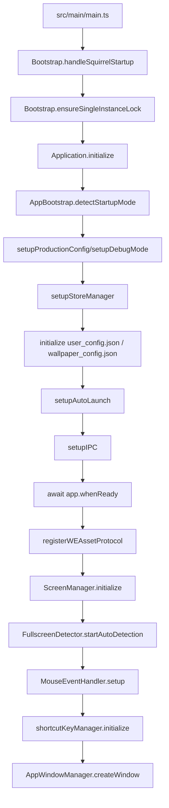
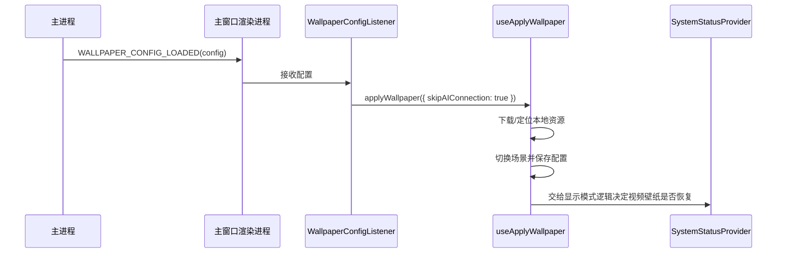
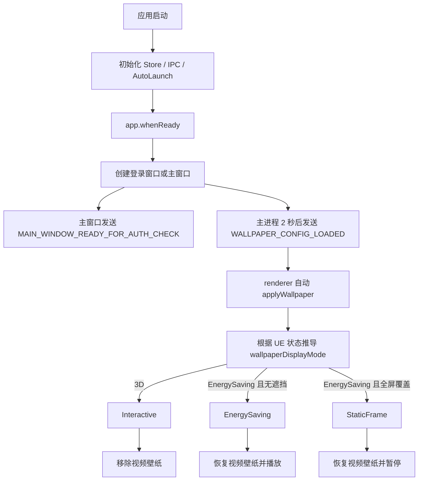

# 启动与节能模式流程梳理

本文从代码实现角度梳理这个软件的启动流程、壁纸恢复流程，以及“节能模式”在主进程、渲染进程、UE/WallpaperBaby 之间的联动关系。

这份文档关注的是通用机制，不依赖某个具体壁纸内容。文中提到的配置样例仅用于验证链路，不代表流程只适用于该样例。

---

## 1. 先说结论

这个项目里和“节能模式”相关的能力，实际上分成了三层：

1. `UE 工作态`：主进程里的 `UEStateManager.currentState.state`，取值是 `3D` 或 `EnergySaving`。
2. `壁纸显示态`：渲染进程 `SystemStatusProvider` 基于 `UE 工作态 + 全屏遮挡结果` 推导出的 `Interactive / EnergySaving / StaticFrame`。
3. `壁纸载体`：
   - `3D / Interactive` 时以 UE/WallpaperBaby 为主，视频壁纸会被移除。
   - `EnergySaving` 时恢复视频壁纸并播放。
   - `StaticFrame` 时恢复视频壁纸但暂停播放，相当于“静帧节能”。

所以，“设置节能模式”不是一个单点动作，而是：

- 改变 UE 工作态。
- 由该状态推导出 Electron 层壁纸显示态。
- 再由显示态决定视频壁纸是恢复播放、暂停播放，还是被移除。

---

## 2. 关键概念与职责边界

### 2.1 主进程启动编排

- 入口是 `src/main/main.ts`。
- `Bootstrap` 负责处理 Squirrel 安装事件与单实例锁。
- `Application.initialize()` 负责完整启动编排。
- `AppBootstrap` 负责启动模式检测、Store 初始化、配置文件初始化、自启动管理器初始化、IPC 注册。
- `AppWindowManager` 负责决定创建登录窗口还是主窗口，并在主窗口阶段挂上托盘、菜单、WebSocket、壁纸配置自动恢复。

### 2.2 两套“状态切换”通道

项目里存在两条不同的 UE 状态切换通道：

1. `IPCChannels.UE_CHANGE_STATE`
   - 由渲染进程调用到主进程。
   - 主进程只执行 `UEStateManager.changeUEState(state)`。
   - 这条链路会更新主进程内存态并广播状态变化，但不会主动通过 WebSocket 把命令发给 UE。

2. `IPCChannels.UE_REQUEST_CHANGE_STATE`
   - 由渲染进程调用到主进程。
   - 主进程会通过 `wsService.send({ type: 'changeUEState' })` 下发给 UE。
   - 如果目标是 `3D`，主进程还会尝试补一次 `embedToDesktop()`。

这意味着：

- “Electron 层的节能/互动显示切换”和“真正通知 UE 改模式”在当前实现里不是同一条链路。
- 文档分析时必须把这两条链路区分开。

### 2.3 节能相关的三种显示结果

渲染进程 `SystemStatusProvider` 用下面的规则推导 `wallpaperDisplayMode`：

- `ueState === '3D'` -> `Interactive`
- `ueState === 'EnergySaving' && 目标屏幕被全屏窗口覆盖` -> `StaticFrame`
- `ueState === 'EnergySaving' && 未被全屏覆盖` -> `EnergySaving`

其中“目标屏幕是否被全屏覆盖”来自 `FullscreenProvider` 与主进程全屏检测管理器。

---

## 3. 完整启动流程

### 3.1 主进程启动主链路

启动入口如下：

具体分解如下：

1. `src/main/main.ts`
   - 先处理 Squirrel 安装场景。
   - 再申请单实例锁。
   - 然后通过 DI 容器拿到 `Application` 并执行 `initialize()`。

2. `Application.initialize()`
   - 提前挂载生命周期监听。
   - 调用 `AppBootstrap.detectStartupMode()` 判断本次是手动启动还是开机自启。
   - 初始化 Store、配置文件、自启动管理器、IPC。
   - 等待 `app.whenReady()`。
   - 在 ready 后初始化：
     - `WE` 自定义协议
     - `ScreenManager`
     - 全屏检测
     - 鼠标事件处理器
     - 全局快捷键
   - 最后进入 `AppWindowManager.createWindow()` 决定窗口流转。

### 3.2 启动模式判定

启动模式的核心判断在 `AppBootstrap.detectStartupMode()`：

- 开发环境：固定认为不是最小化启动。
- Windows 打包环境：以命令行是否包含 `--hidden` 为准。
- `--hidden` 由 `AutoLaunchManager.enable()` 注册开机自启时写入。

因此当前规则很清晰：

- 有 `--hidden`：认为是开机自启后台启动。
- 没有 `--hidden`：认为是手动启动前台显示。

### 3.3 登录窗口与主窗口分流

`AppWindowManager.createWindow()` 会先检查登录态：

- 未登录：
  - 创建简化托盘。
  - 只打开登录窗口。
  - 登录成功后再补建主窗口并关闭登录窗口。
- 已登录：
  - 直接进入 `createMainWindowFlow()`。

### 3.4 主窗口阶段做了什么

`createMainWindowFlow()` 做的事情按顺序是：

1. 创建主窗口。
2. 调用 `initWallpaperConfig(mainWindow)`，准备把已保存的壁纸配置回推给渲染进程。
3. 启动 WebSocket 服务。
4. 安装主窗口事件处理。
5. 创建/升级托盘。
6. 绑定外链打开逻辑。
7. 检查 `WallpaperBaby.exe` 是否存在，必要时打开下载器窗口。

主窗口 `ready-to-show` 之后：

- 如果是开机自启最小化模式，窗口直接 `hide()` 到托盘。
- 如果是手动启动，窗口 `show()` 并 `focus()`。
- 然后主进程会发 `MAIN_WINDOW_READY_FOR_AUTH_CHECK` 给渲染进程，通知可以开始做认证检查。

---

## 4. 启动时如何恢复壁纸与节能状态

### 4.1 配置文件初始化

启动时，`AppBootstrap.setupStoreManager()` 会初始化两个文件：

- `Setting/user_config.json`
- `Setting/wallpaper_config.json`

其中 `wallpaper_config.json` 的路径来自默认下载目录下的 `Setting` 目录：

- `DownloadPathManager.getDefaultDownloadPath()/Setting/wallpaper_config.json`

如果文件不存在，会自动创建默认配置。

### 4.2 主进程如何把配置发给渲染进程

`AppWindowManager.createMainWindowFlow()` 中调用的 `initWallpaperConfig(mainWindow)` 会：

1. 延迟 2 秒，等待渲染进程监听器就绪。
2. 读取 `wallpaper_config.json`。
3. 向主窗口发送 `IPCChannels.WALLPAPER_CONFIG_LOADED`。

### 4.3 渲染进程如何恢复壁纸

恢复链路如下：

`WallpaperConfigListener` 收到配置后会：

- 组装一个最小壁纸对象。
- 调用 `useApplyWallpaper().applyWallpaper(...)`。
- 传入 `skipAIConnection: true`，也就是启动恢复壁纸时先不主动连 AI。

### 4.4 启动后是否自动拉起 WallpaperBaby

渲染进程 `App.tsx` 中有两个相关自动启动逻辑：

1. `UEAutoStartOnLogin`
   - 用户登录后触发。
   - 先把主进程状态设置成 `EnergySaving`。
   - 再调用 `ensureWallpaperBabyRunning()`，保证 UE 进程存在。

2. `autoStartWallpaperBaby()`
   - App 根组件挂载后执行。
   - 如果用户未登录，则跳过。
   - 会查询 `CHECK_STARTUP_MODE` 判断是否为开机自启。
   - 开机自启时延迟 20 秒再启动 WallpaperBaby。
   - 手动启动时立即尝试启动。
   - 启动前还会读取 `WALLPAPER_BABY_GET_CONFIG` 判断是否允许自动启动，以及使用哪个 `exePath`。

这说明启动恢复分两层：

- 壁纸配置恢复：主窗口创建后基本一定会走。
- WallpaperBaby 自动拉起：依赖登录态、自动启动配置和启动模式。

---

## 5. 节能模式的完整流程

### 5.1 状态来源

节能相关状态主要来自以下几处：

- 主进程内存态：`UEStateManager.currentState.state`
- 主进程运行/嵌入态：`UEStateManager.currentState.isRunning / isEmbedded`
- 渲染进程派生显示态：`SystemStatusProvider.wallpaperDisplayMode`
- 全屏遮挡结果：`FullscreenProvider`
- 持久化壁纸配置：`wallpaper_config.json`
- WallpaperBaby 启动配置：`auto-launch-config` 里的 `wallpaperBaby`

### 5.2 节能模式的显示规则

渲染进程 `SystemStatusProvider` 的关键逻辑可以概括为：

1. 先看 `status.ueState.state`
   - `3D` -> 互动模式
   - `EnergySaving` -> 进入节能分支
2. 如果是节能分支，再看目标屏幕是否被全屏内容覆盖
   - 覆盖 -> `StaticFrame`
   - 未覆盖 -> `EnergySaving`

然后根据 `wallpaperDisplayMode` 执行不同的壁纸动作：

- `Interactive`
  - 调用 `REMOVE_DYNAMIC_WALLPAPER`
  - 即移除视频壁纸，交给 UE 3D 渲染

- `EnergySaving`
  - 如果刚从 `Interactive` 退出，先根据配置恢复视频壁纸
  - 然后向视频窗口发送 `play-video`

- `StaticFrame`
  - 如果刚从 `Interactive` 退出，先根据配置恢复视频壁纸
  - 然后向视频窗口发送 `pause-video`

可以把它理解成：

- `EnergySaving` = 视频壁纸继续存在并播放
- `StaticFrame` = 视频壁纸继续存在但暂停

### 5.3 从配置恢复视频壁纸的逻辑

当系统决定“退出 3D，需要恢复视频壁纸”时，`handleRestoreVideoWallpaper()` 会：

1. 读取 `wallpaper_config.json`
2. 取出 `wallpaperId` 和可能缓存的 `localVideoPath`
3. 如果没有缓存路径，再调用 `getLocalVideoPath(wallpaperId)` 扫描本地目录
4. 调用主进程 `SET_DYNAMIC_WALLPAPER(localVideoPath)`
5. 再向视频窗口发送 `play-video`

这条链路和具体壁纸内容无关，只依赖：

- 当前配置里有没有合法的 `wallpaperId`
- 本地能否找到可播放视频文件

### 5.4 “设置节能模式”的几条入口

当前代码里，和节能模式有关的入口至少有四类：

1. `SystemStatusContext.switchWallpaperMode('EnergySaving')`
   - 内部调用 `SystemStatusManager.changeUEState('EnergySaving')`
   - 最终落到 `IPCChannels.UE_CHANGE_STATE`
   - 只改主进程状态并触发显示层联动

2. 托盘菜单
   - `TrayManager.switchWallpaperMode('EnergySaving' | '3D')`
   - 也是直接调用 `UEStateManager.changeUEState(mode)`
   - 同样属于“主进程状态切换”

3. 渲染进程要求真正通知 UE
   - 例如 `NavBar` 切去聊天页时会调用 `UE_REQUEST_CHANGE_STATE('3D')`
   - `Alt+X` 快捷键监听器也会调用 `UE_REQUEST_CHANGE_STATE('3D')`
   - 这类入口会通过 WebSocket 下发 `changeUEState`

4. UE 主动回推
   - WebSocket `UEState` 消息：主进程同步状态
   - WebSocket `enterEnergySavingMode` 消息：主进程先设为 `EnergySaving`，再 `stopUE()`

### 5.5 一个非常重要的实现细节

当前实现中，“切换为节能模式”并不总是意味着“通知 UE 进入节能，或者停止 UE 进程”。

具体要区分：

#### A. 本地状态切换

- `UE_CHANGE_STATE`
- `TrayManager.switchWallpaperMode()`
- `SystemStatusManager.changeUEState()`

这些路径的效果是：

- 更新主进程的 `UEStateManager.currentState.state`
- 通知 renderer，触发 `Interactive / EnergySaving / StaticFrame` 的显示层切换
- 但不会自动走 `wsService.send(changeUEState)`

#### B. 真正请求 UE 切换

- `UE_REQUEST_CHANGE_STATE`

这条路径才会：

- 通过 WebSocket 向 UE 发送 `changeUEState`
- 在目标为 `3D` 时，必要时自动重新嵌入桌面

#### C. UE 主动要求节能

- `enterEnergySavingMode`

这条路径最“重”：

1. 主进程把状态设为 `EnergySaving`
2. 主进程直接 `stopUE()`

因此：

- 代码里的“节能模式”既可能只是显示层降级，也可能意味着 UE 被停掉。
- 具体是哪一种，要看入口是哪条链路。

---

## 6. WallpaperBaby 启动与 3D/节能切换关系

### 6.1 启动 UE 是两阶段的

`DesktopEmbedderManager` 的设计是“两阶段启动”：

1. `startEmbedder(id, exePath)`
   - 只启动程序，不立即嵌入
2. 等收到 `ueIsReady`
   - 再根据当前状态决定是否执行嵌入

`UEStateManager.handleUEReadyMessage()` 里有明确逻辑：

- 当前状态是 `3D` -> 执行 `embedToDesktop()`
- 当前状态不是 `3D`，例如 `EnergySaving` -> 不嵌入

这和节能模式的设计是吻合的：

- 互动模式才需要 UE 真正嵌入桌面。
- 节能模式不要求 UE 占据桌面渲染。

### 6.2 UE 启动完成后的默认状态

`handleUEStartedMessage()` 会把状态更新成：

- `isRunning = true`
- `state = '3D'`
- `isEmbedded = false`

后续是否真的嵌入，由 `ueIsReady` 到来后再决定。

这解释了为什么代码里会把“已启动”和“已嵌入”拆成两个阶段看待。

---

## 7. 实际数据/场景对照验证

这里不用某一个壁纸内容去特化说明，而是选取了几类真实配置和代码中的真实分支做对照。

| 案例 | 实际数据/代码事实 | 验证结论 |
| --- | --- | --- |
| 启动模式：手动启动 | `AppBootstrap.detectStartupMode()` 以 `process.argv.includes('--hidden')` 判断；没有 `--hidden` 时 `isStartMinimized = false` | 手动启动会显示主窗口，不走托盘静默启动 |
| 启动模式：开机自启 | `AutoLaunchManager.enable()` 注册登录项时固定写入 `args: ['--hidden']` | 开机自启的最小化启动与后续 20 秒延迟拉起 WallpaperBaby 是同一套链路 |
| 壁纸配置恢复 | `wallpaper_config.json` 会在启动时自动存在，主窗口创建后 2 秒通过 `WALLPAPER_CONFIG_LOADED` 回推给 renderer | 壁纸恢复是事件驱动的，不依赖用户手工重新选壁纸 |
| 显示态派生：普通节能 | `ueState = EnergySaving` 且目标屏幕未被全屏覆盖时，`wallpaperDisplayMode = EnergySaving` | 会恢复视频壁纸并播放，属于“视频节能” |
| 显示态派生：静帧节能 | `ueState = EnergySaving` 且目标屏幕被全屏覆盖时，`wallpaperDisplayMode = StaticFrame` | 会恢复视频壁纸但暂停播放，进一步降低资源消耗 |
| 配置样本的通用性 | 默认 `wallpaper_config.json` 样例里包含 `wallpaperId / wallpaperTitle / sceneId / localVideoPath / appliedAt` 等字段；恢复逻辑实际只依赖 `wallpaperId` 与可用视频路径 | 启动恢复链路本质依赖的是“配置结构”而不是某个特定壁纸内容 |
| WallpaperBaby 默认配置 | `auto-launch-config` 默认值中 `wallpaperBaby.autoStart = true`，`exePath` 为相对默认路径，`launchArgs = -A2FVolume=0` | 只要登录态成立且路径可解析，启动阶段会默认尝试拉起 WallpaperBaby |

补充说明：

- 当前仓库工作区里没有现成的 `resources/wallpapers/**/extracted` 样本可供交叉读取，所以这次对照验证主要基于仓库内真实配置默认值和真实代码分支。
- 这不影响本文对“启动/节能流程”的结论，因为这些流程依赖的是框架级状态与配置结构，而不是某一份资源内容。

---

## 8. 现阶段可以稳定认知的流程图

---

## 9. 当前实现的注意点

### 9.1 “节能模式”有两种语义

当前代码中的“节能模式”至少有两种语义：

1. 只是把 Electron 层壁纸从 3D 互动切回视频/静帧节能。
2. 由 UE 主动回推 `enterEnergySavingMode`，主进程直接把 UE 停掉。

后续如果要继续演进这块逻辑，建议始终显式区分：

- `显示层节能`
- `UE 进程级节能`

### 9.2 目前最稳的持久化锚点是 `wallpaper_config.json`

无论启动恢复、退出 3D 恢复视频、还是切换显示态，最终都强依赖 `wallpaper_config.json` 中的壁纸信息与本地视频路径可解析。

因此后续如果改壁纸切换流程，最需要保护的是：

- `wallpaperId`
- `localVideoPath`
- `sceneId`
- `appliedAt`

这些字段的可用性。

### 9.3 互动模式和节能模式的真正边界不在 UI，而在 `wallpaperDisplayMode`

用户看到的是“互动/节能”，但最终决定系统做什么的不是按钮文案，而是 `SystemStatusProvider` 推导出的：

- `Interactive`
- `EnergySaving`
- `StaticFrame`

只有把这个派生层一起看，才能真正理解节能行为。
