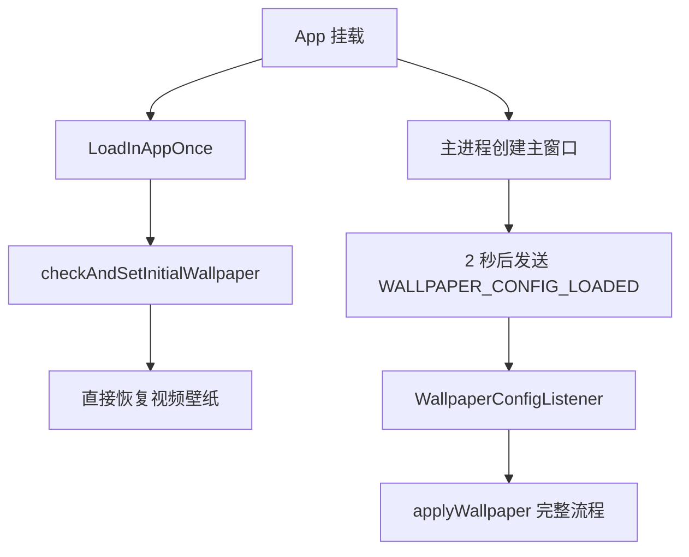
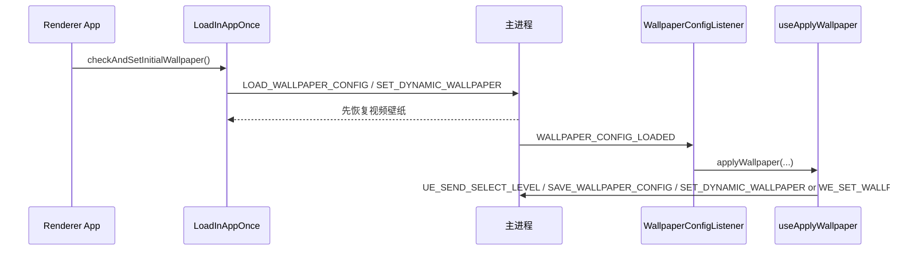
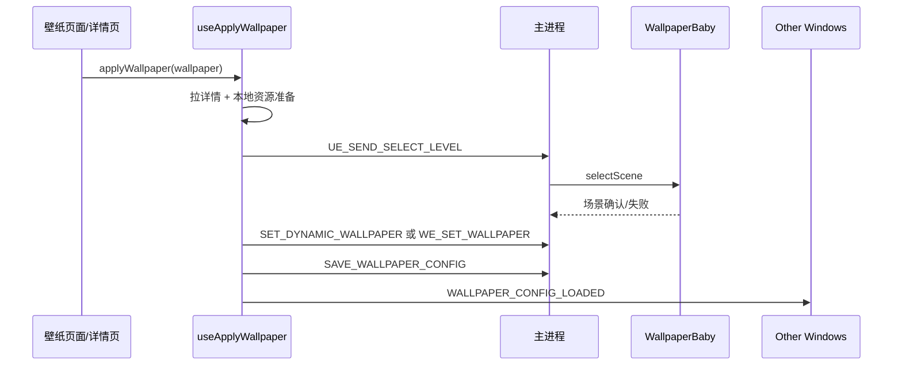
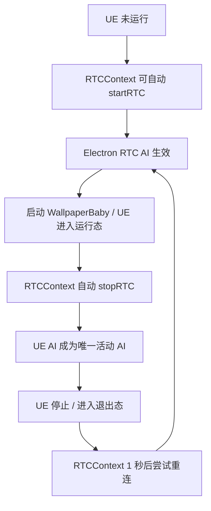

# 壁纸切换与模式流转梳理

本文系统梳理本项目里和“壁纸切换”相关的主要流程，包括：

- 启动时如何进入上次壁纸
- 用户主动切换壁纸时做了哪些操作
- Electron 自己显示的壁纸和 UnrealEngine/WallpaperBaby 显示的壁纸如何分工
- UE AI 与 Electron RTC AI 两套实现如何互斥
- 出于节能需求，系统会如何在几种模式之间自动切换

这份文档关注的是通用机制，而不是某一个具体壁纸资源的特化逻辑。

---

## 1. 总结版结论

这个项目里的“壁纸系统”并不是一个单一模块，而是由三套运行载体叠加出来的：

1. `Electron 视频壁纸`
   - 由 `VideoWindowManager` 管理。
   - 本质上是一个被嵌入桌面的 Electron 视频窗口。
   - 主要承接普通视频壁纸，以及节能模式下的回退显示。

2. `Electron WE 壁纸`
   - 由 `WEWindowManager` 管理。
   - 本质上是一个单独的 WE 渲染窗口。
   - 技术上也属于“Electron 自己显示的壁纸”。

3. `UE / WallpaperBaby 壁纸`
   - 由 `UEStateManager + DesktopEmbedderManager + WebSocket` 管理。
   - 这是 3D 互动壁纸路径。
   - 一旦进入这一层，视频壁纸通常会被移除或退居备用。

与此同时，项目中还存在两套 AI：

- `UE AI`
  - 通过 WebSocket 和 WallpaperBaby 通信。
  - 文本/状态消息主要走 `websocket/handlers/chat.handler.ts` 回到 renderer。

- `Electron RTC AI`
  - 通过 `RTCContext -> useRTCChat -> main/modules/rtc-chat` 这条链路工作。
  - 当 UE 运行时会自动停掉 RTC；当 UE 停止时会自动尝试恢复 RTC。

所以“切换壁纸”并不只是换一个资源文件，而是可能同时涉及：

- 下载/查找本地资源
- 切换 UE 场景
- 切换桌面承载窗口
- 保存壁纸配置
- 同步角色信息
- 决定启用哪一套 AI
- 根据节能策略在 `Interactive / EnergySaving / StaticFrame` 之间切换

---

## 2. 参与者与职责边界

## 2.1 主进程相关

- `src/main/app/Application.ts`
  - 启动编排总入口。

- `src/main/app/AppWindowManager.ts`
  - 主窗口/登录窗口创建。
  - 主窗口阶段启动 WebSocket、托盘、自动壁纸恢复。

- `src/main/modules/wallpaper/ipc/wallpaperConfigHandlers.ts`
  - 读写 `wallpaper_config.json`
  - 启动时把配置通过 `WALLPAPER_CONFIG_LOADED` 回推给主窗口渲染进程。

- `src/main/modules/wallpaper/ipc/wallpaperHandlers.ts`
  - `SET_DYNAMIC_WALLPAPER`
  - `REMOVE_DYNAMIC_WALLPAPER`
  - `WE_SET_WALLPAPER`
  - `WE_REMOVE_WALLPAPER`

- `src/main/modules/window/video/VideoWindowManager.ts`
  - Electron 视频壁纸窗口的创建、嵌入、切屏、销毁。

- `src/main/modules/window/we/WEWindowManager.ts`
  - Electron WE 壁纸窗口的加载、嵌入、移除。

- `src/main/modules/ue-state/managers/UEStateManager.ts`
  - UE 进程状态、场景状态、嵌入状态、工作模式的统一管理。

- `src/main/modules/websocket/bridge/ipc-bridge.ts`
  - 把 renderer 的 IPC 请求桥接到 UE WebSocket 消息。

## 2.2 渲染进程相关

- `src/renderer/hooks/useApplyWallpaper/index.ts`
  - 用户主动切换壁纸的主流程入口。

- `src/renderer/components/CommomListener/WallpaperConfigListener/index.tsx`
  - 启动时接收主进程回推的壁纸配置并自动应用。

- `src/renderer/components/LoadInAppOnce/index.tsx`
  - App 挂载时直接恢复一次视频壁纸。

- `src/renderer/contexts/SystemStatusContext/index.tsx`
  - 根据 UE 状态与全屏遮挡结果推导 `wallpaperDisplayMode`。
  - 决定何时移除视频壁纸、恢复视频壁纸、暂停视频。

- `src/renderer/contexts/RTCContext/RTCContext.tsx`
  - Electron RTC AI 的自动启停。

- `src/renderer/components/CommomListener/UETextMessageListener/index.tsx`
  - 消费 UE AI 消息，也接收 RTC 字幕并转换到统一消息流。

---

## 3. 当前实际存在的三种壁纸后端

## 3.1 Electron 视频壁纸

主路径：

- `useApplyWallpaper -> fileManager.setDynamicWallpaper -> IPC SET_DYNAMIC_WALLPAPER -> VideoWindowManager.setWallpaper`

特点：

- 依赖本地视频文件路径。
- `wallpaper_config.json` 的 `localVideoPath` 会被优先用于恢复。
- 节能模式下，它是最主要的“回退显示载体”。

## 3.2 Electron WE 壁纸

主路径：

- `useApplyWallpaper -> fileManager.setWEWallpaper -> IPC WE_SET_WALLPAPER -> WEWindowManager.setWallpaper`

特点：

- 依赖 WE 壁纸目录。
- 目录中至少要能找到 `project.json / scene.pkg / gifscene.pkg`。
- 技术上也是 Electron 自己显示壁纸，只是渲染后端不是视频，而是 WE renderer。

## 3.3 UE / WallpaperBaby 3D 壁纸

主路径：

- `ensureWallpaperBabyRunning -> IPC UE_START -> UEStateManager.startUE -> DesktopEmbedderManager.startEmbedder`
- 场景切换：`UE_SEND_SELECT_LEVEL -> UEStateManager.selectScene`
- 模式切换：`UE_REQUEST_CHANGE_STATE` 或 UE 自己回推 `UEState / enterEnergySavingMode`

特点：

- 这是互动模式路径。
- 进入互动模式后，Electron 层的视频壁纸通常会被移除。
- `ueIsReady` 到达后，只有当前状态是 `3D` 才会执行桌面嵌入。

---

## 4. 启动时进入壁纸

启动阶段实际上存在两条“恢复上次壁纸”的链路，它们不是同一件事。

## 4.1 第一条：直接恢复视频壁纸

App 根组件里挂了 `LoadInAppOnce`：

- `LoadInAppOnce -> useApplyWallpaper().checkAndSetInitialWallpaper()`

它做的事情很直接：

1. 调用 `getInitialVideoPath()`
2. 优先从 `wallpaper_config.json` 读取 `localVideoPath`
3. 如果没有，就根据 `wallpaperId` 扫描本地目录找视频
4. 还是没有，就回退到默认视频
5. 调用 `SET_DYNAMIC_WALLPAPER`

这条链路的特点是：

- 只面向“视频壁纸恢复”
- 不切场景
- 不处理角色切换
- 不处理 AI
- 速度快，适合启动早期先把桌面显示出来

## 4.2 第二条：主进程回推配置，走完整应用流程

主进程主窗口创建后，会调用：

- `initWallpaperConfig(mainWindow)`

这会在约 2 秒后：

1. 读取 `wallpaper_config.json`
2. 发送 `WALLPAPER_CONFIG_LOADED`

然后 renderer 里的 `WallpaperConfigListener` 会：

1. 接收配置
2. 构造壁纸对象
3. 调用 `applyWallpaper({ skipAIConnection: true })`

这条链路会走完整的切换流程：

- 获取壁纸详情
- 下载/确认本地资源
- 切换 UE 场景
- 设置系统壁纸
- 设置角色信息
- 保存配置
- 通知其他窗口

## 4.3 启动阶段的真实结构

因此启动时不是“只有一次恢复”，而是：

- 先快速恢复视频壁纸
- 再用完整 `applyWallpaper` 重新把业务状态补齐

这也是后续理解“为什么启动阶段会有多次壁纸/场景动作”的关键。

## 4.4 启动阶段和 WallpaperBaby 的关系

启动时 WallpaperBaby 还有独立自动拉起逻辑：

1. `UEAutoStartOnLogin`
   - 用户登录后：
   - 先 `UE_CHANGE_STATE('EnergySaving')`
   - 再 `ensureWallpaperBabyRunning()`

2. `App.tsx` 中的 `autoStartWallpaperBaby()`
   - 登录态存在时执行
   - 查询 `CHECK_STARTUP_MODE`
   - 开机自启时延迟 20 秒
   - 手动启动时立即尝试启动
   - 启动前读取 `WALLPAPER_BABY_GET_CONFIG`

所以“启动进入壁纸”至少包含三股并行逻辑：

- 直接恢复视频壁纸
- 主进程回推配置后再完整应用一次壁纸
- 条件满足时自动拉起 WallpaperBaby

---

## 5. 用户主动切换壁纸

## 5.1 入口并不唯一，但最后都会收敛到 `useApplyWallpaper`

当前仓库里常见入口有：

- `src/renderer/Pages/myAssets/index.tsx`
- `src/renderer/Pages/WallPaper/index.tsx`
- `src/renderer/components/DetailPanel/index.tsx`
- 启动恢复：`WallpaperConfigListener`

这些入口最终都会走：

- `useApplyWallpaper().applyWallpaper(...)`

## 5.2 `applyWallpaper` 的完整步骤

`useApplyWallpaper` 当前主流程可以概括为：

1. `fetchWallpaperDetail`
   - 调 API 获取壁纸详情与 `config_params`

2. `validatePersonaInfo`
   - 校验人设信息，确保壁纸可用于当前业务

3. `saveWallpaperToLocal`
   - 如果本地没有，先下载缩略图/视频并保存 `info.json`

4. `performSceneSwitch`
   - 如果详情里有 `scene_id`，向主进程发送 `UE_SEND_SELECT_LEVEL`
   - 主进程由 `UEStateManager.selectScene()` 统一处理
   - 要等待 UE 场景切换确认

5. `setSystemWallpaper`
   - 根据当前 `wallpaperDisplayMode` 和 `wallpaperType` 决定设置哪一类桌面壁纸

6. `setupCharacterInfo`
   - 设置当前角色与当前壁纸标题

7. `saveWallpaperConfigToFile`
   - 把当前壁纸保存到 `wallpaper_config.json`

8. `notifyOtherWindows`
   - 给 `WallpaperInput_Window` 广播 `WALLPAPER_CONFIG_LOADED`

9. `trackWallpaperApplied`
   - 发送埋点

## 5.3 场景切换并不是“顺手切一下”，而是一个受控事务

`switchScene(detail)` 的行为不是简单发命令就结束，而是：

1. 先用 `sceneHandler` 验证场景和角色绑定关系
2. 调用主进程 `UE_SEND_SELECT_LEVEL`
3. 主进程走 `UEStateManager.selectScene(sceneId, args.data)`
4. renderer 侧等待：
   - `UE_SCENE_CHANGED(confirmed=true)` 视为成功
   - `UE_SCENE_CHANGE_FAILED` 视为失败
   - 超时也视为失败

也就是说，用户切换壁纸时，“切场景”本身就是完整的一段状态机流程。

---

## 6. 用户切换壁纸时，系统到底会设置哪种桌面壁纸

`setSystemWallpaper(...)` 的核心判断是：

## 6.1 如果当前是 `Interactive`

也就是：

- `wallpaperDisplayMode === 'Interactive'`

那么：

- 不会立刻重新设置视频壁纸
- 直接提示“UE 场景已切换，视频壁纸将在退出 3D 模式后自动恢复”

这说明：

- 互动模式下，桌面主显示权属于 UE/WallpaperBaby
- Electron 视频壁纸只是后备

## 6.2 如果是 WE 壁纸

当 `wallpaper.wallpaperType === 'we'` 时：

- 走 `setWEWallpaper(weWallpaperDir)`
- 最终由 `WEWindowManager` 加载并显示

## 6.3 否则默认按视频壁纸处理

当前默认分支就是：

- 取本地视频路径
- 调 `SET_DYNAMIC_WALLPAPER`
- 由 `VideoWindowManager` 设置视频壁纸

所以从桌面载体上看，用户切换壁纸后的分派规则是：

| 条件 | 结果 |
| --- | --- |
| 当前显示态是 `Interactive` | 由 UE 继续显示，不立即重设视频 |
| `wallpaperType === 'we'` | 走 WE 壁纸窗口 |
| 其他情况 | 走视频壁纸窗口 |

---

## 7. `wallpaper_config.json` 是整个系统的持久化锚点

每次成功应用壁纸后，`saveWallpaperConfigToFile()` 会把这些关键字段写进去：

- `wallpaperType`
- `wallpaperId`
- `wallpaperTitle`
- `wallpaperThumbnail`
- `wallpaperPreview`
- `sceneId`
- `localVideoPath`
- `characterData`
- `appliedAt`

它的作用至少有三层：

1. 启动时恢复壁纸
2. 退出 3D 后恢复视频壁纸
3. 恢复角色/场景上下文

换句话说，壁纸系统里最重要的持久化锚点不是 UI 状态，而是这个配置文件。

---

## 8. AI 双栈：UE AI 与 Electron RTC AI

## 8.1 UE AI 的链路

UE AI 相关消息主要走：

- UE -> WebSocket -> `main/modules/websocket/handlers/chat.handler.ts`

然后主进程会把消息转发给：

- 主窗口 renderer
- `WallpaperInput` 窗口

典型消息包括：

- `textMessage`
- `aiStatus`
- `requestChatMode`

对应 renderer 侧主要由：

- `UETextMessageListener`
- `RequestChatModeListener`

来消费。

## 8.2 Electron RTC AI 的链路

Electron 自己的 AI 主要走：

- `RTCContext -> useRTCChat -> rtcChatAPI -> main/modules/rtc-chat/ipc/handlers.ts`

特点：

- RTC 会在主进程 `RTCChatManager` 中维持会话
- 字幕回调会发回 renderer
- `RTCContext` 再把字幕转换成 `rtc-subtitle-update` 自定义事件
- `UETextMessageListener` 会把 RTC 字幕映射成统一的消息格式

也就是说：

- UE AI 和 RTC AI 最终在 UI 层会被收敛到同一个消息展示体系
- 但底层连接与运行机制完全不同

## 8.3 两套 AI 为什么不能并存

当前代码层面，互斥主要是通过 `RTCContext` 监听 UE 运行状态实现的：

- 当 `isUERunning === true`
  - 如果 RTC 正在连接，就自动 `stopRTC()`

- 当 `isUERunning === false`
  - 如果开启了自动连接并且有角色信息
  - 就在 1 秒后尝试 `startRTC()`

所以现状可以概括为：

- `UE 运行` -> 优先使用 UE AI
- `UE 停止` -> 自动切回 Electron RTC AI

这正好对应了你的背景描述：两套 AI 不能并存。

## 8.4 和壁纸切换的关系

这套互斥逻辑意味着：

- 壁纸切到 UE 互动态时，不只是“换桌面显示载体”
- 还会连带把 AI 通道切到 UE

反过来：

- 如果因为节能或退出导致 UE 停止
- 系统又会自动尝试恢复 RTC AI

所以“壁纸切换”和“AI 切换”不是并列功能，而是耦合在一起的。

---

## 9. 节能驱动下的自主模式切换

壁纸系统当前真正运行时的模式，不是简单的“视频 vs UE”，而是至少有两层状态。

## 9.1 主进程 UE 工作态

主进程里只有：

- `3D`
- `EnergySaving`

由 `UEStateManager.currentState.state` 维护。

## 9.2 渲染进程派生显示态

`SystemStatusProvider` 会再结合全屏遮挡结果，推导出：

- `Interactive`
- `EnergySaving`
- `StaticFrame`

规则如下：

- `ueState === '3D'` -> `Interactive`
- `ueState === 'EnergySaving'` 且目标屏幕未被遮挡 -> `EnergySaving`
- `ueState === 'EnergySaving'` 且目标屏幕被全屏遮挡 -> `StaticFrame`

## 9.3 三种显示态分别做什么

### `Interactive`

- 调 `REMOVE_DYNAMIC_WALLPAPER`
- 视频壁纸被移除
- 桌面显示由 UE 接管

### `EnergySaving`

- 必要时从 `wallpaper_config.json` 恢复视频壁纸
- 向视频窗口发送 `play-video`

### `StaticFrame`

- 必要时从 `wallpaper_config.json` 恢复视频壁纸
- 向视频窗口发送 `pause-video`

所以：

- `EnergySaving` 是“播放中的视频节能”
- `StaticFrame` 是“暂停中的静帧节能”

## 9.4 触发这些切换的入口

当前常见入口有：

1. 本地状态切换
   - `UE_CHANGE_STATE`
   - `SystemStatusContext.switchWallpaperMode()`
   - 托盘 `switchWallpaperMode()`

2. 真正通知 UE 切换
   - `UE_REQUEST_CHANGE_STATE`
   - `NavBar` 切聊天页
   - `Alt+X`

3. UE 主动回推
   - `UEState`
   - `enterEnergySavingMode`

其中最重要的区别是：

- `UE_CHANGE_STATE` 主要驱动 Electron 本地状态与显示层切换
- `UE_REQUEST_CHANGE_STATE` 才会通过 WebSocket 真正下发 `changeUEState` 给 UE

---

## 10. 从用户视角看，几个最重要的完整时序

## 10.1 启动后进入上次壁纸

## 10.2 用户主动切换壁纸

## 10.3 UE 与 RTC AI 的互斥切换

---

## 11. 当前实现里需要特别注意的“现状，不是理想设计”

## 11.1 `skipAIConnection` 目前没有真正生效

虽然多个调用点都在传：

- `Pages/myAssets`
- `Pages/WallPaper`
- `WallpaperConfigListener`

但 `useApplyWallpaper` 当前 `ApplyWallpaperOptions` 并没有实际消费 `skipAIConnection`。

也就是说：

- 代码意图上希望“切壁纸时先不连 AI”
- 但当前这个参数本身并没有形成真实分支

这在理解现有流程时必须明确，不能把它当成已经稳定生效的机制。

## 11.2 `wallpaper-character-changed` 当前只有监听，没有派发

`RTCContext` 会监听：

- `wallpaper-character-changed`

并据此尝试切换角色与决定是否连接 RTC。

但当前仓库中没有找到对应的事件派发点。

这意味着：

- `RTCContext` 预期中的“随壁纸角色变化自动切 RTC 角色”链路，目前并不完整

## 11.3 启动恢复当前仍然明显偏向视频壁纸

虽然配置里已经有：

- `wallpaperType`

但当前启动恢复的两条路径：

- `checkAndSetInitialWallpaper()`
- `WallpaperConfigListener -> applyWallpaper(...)`

都明显对“视频壁纸恢复”更友好。

特别是：

- `checkAndSetInitialWallpaper()` 只会走 `SET_DYNAMIC_WALLPAPER`
- 启动监听器构造的壁纸对象也没有完整携带 `wallpaperType`

这说明现阶段的启动恢复机制，仍然是“视频壁纸优先”的。

## 11.4 `wallpaperType` 虽然有 `ue` 枚举，但主流程里几乎没有独立分支

共享类型允许：

- `video`
- `we`
- `ue`

但当前切换主流程中真正有明确分支的只有：

- `we`
- 默认视频分支

UE 互动壁纸更多是通过：

- `scene_id`
- UE 场景切换
- `wallpaperDisplayMode === Interactive`

这些条件间接驱动的，而不是一个清晰的 `wallpaperType === 'ue'` 独立路径。

---

## 12. 建议把这套系统理解成“三层耦合”

如果只从“换壁纸”角度看，代码会显得非常绕。更好的理解方式是：

### 第一层：内容层

- 当前壁纸是谁
- 当前场景是谁
- 当前角色是谁

### 第二层：承载层

- 是视频窗口在显示
- 是 WE 窗口在显示
- 还是 UE/WallpaperBaby 在显示

### 第三层：会话层

- 当前是否走 UE AI
- 当前是否走 RTC AI
- 是否因为节能/窗口可见性/UE 运行态而被切换

当前项目的复杂度，正是因为每次“壁纸切换”都可能同时穿透这三层。

---

## 13. 最后再收敛成一句话

这个项目里的“切换壁纸”，本质上是一个跨越：

- `资源落地`
- `UE 场景切换`
- `桌面窗口承载切换`
- `配置持久化`
- `角色上下文同步`
- `AI 通道互斥`
- `节能模式自动降级`

的复合事务。

如果后续要继续重构这一块，最值得优先拆开的不是某个具体壁纸逻辑，而是以下三条边界：

1. `启动恢复` 和 `用户主动切换`
2. `桌面显示载体切换` 和 `业务状态切换`
3. `壁纸切换` 和 `AI 通道切换`

只有先把这三层边界拆开，后面的行为才会真正稳定、可维护。
