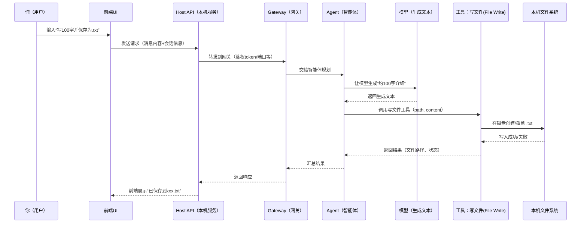

## 这件事你在“对谁说话”？

当你发送：**“帮我写个100字关于open claw的介绍，并保存为.txt”**，你其实是在对一个“会调用工具的 AI 助手”下指令。

它通常由几层组成（名字可能不同，但职责类似）：

- **前端 UI**：你输入这句话的地方（聊天框/命令面板）。
- **Host API（本机服务）**：负责接收前端请求、管理会话、转发到网关（日志里能看到类似 `Host API server listening on http://127.0.0.1:3210`）。
- **Gateway（网关进程）**：负责和模型/工具执行环境通信（日志里有 `gateway --port ... --token ...`）。
- **Agent（智能体）**：把“自然语言任务”拆成“可执行步骤”，并决定要不要调用“写文件”这类工具。
- **Tools（工具）**：例如“写文件到磁盘”“读文件”“跑命令”等。

## 发生了什么：从一句话到一个 `.txt`

你这句话同时包含了两类要求：

- **生成内容**：写一段“100字介绍”
- **产生副作用**：把内容**保存为一个 `.txt` 文件**

系统的典型执行流程是这样的：



你可以把它理解为：**模型负责“写什么”，工具负责“怎么落盘”**。

## ClawX 里的“真实执行链路”（按源码走一遍）

这一段是把你在 ClawX（React + Electron）里点一下“发送消息”后，**消息如何到达 OpenClaw Gateway、以及结果如何回到 UI**讲清楚。你提到的几个点（React → 主进程才有网络权限、用 WS 不是 SSE、结果通过 WS/IPC 回来）在本项目里都能在源码里对应上。

### 0) 先记住 3 个“通道”

- **IPC（Renderer ↔ Main）**：渲染进程（React）想要“做有权限的事情”（联网、读写磁盘等），通常会通过 `window.electron.ipcRenderer.invoke/on` 去找主进程。
- **Host API（Main 暴露的本机 HTTP 服务）**：主进程自己起了一个本地 HTTP Server（默认 `127.0.0.1:3210`），UI 也能“看起来像 fetch 一样”调用它，但实际为了避免 CORS，依然是 **Renderer → IPC → Main 代发请求**。
- **Gateway WebSocket（OpenClaw 网关）**：OpenClaw Gateway 在 `18789`（或动态端口）提供 `/ws`，用于 RPC + 事件推送。ClawX 使用的握手是 `connect.challenge → connect`。

### 0.5) 你问的关键：ClawX 是不是“启动应用就先建立 WebSocket 连接”？

结论先说清楚（按 ClawX 当前源码）：

- **Gateway 的 WebSocket 连接是在“主进程（Main）里”建立的，不在 React（Renderer）里建立。**
- **是否“启动应用就建立 WS”取决于一个设置 `gatewayAutoStart`**：
  - 如果 `gatewayAutoStart === true`：应用启动后（主进程初始化完成）会自动 `gatewayManager.start()`，这会启动/接管 Gateway 并 **建立 WebSocket + 完成握手**。
  - 如果 `gatewayAutoStart === false`：应用启动不会主动连 WS；只有当你在 UI 里点“启动 Gateway”（或其它触发 start 的动作）才会去建立 WS。

你可以按“启动时发生的真实顺序”理解它：

#### A) Electron 主进程启动后做了什么（自动启动点在哪里）？

入口在：`ClawX/electron/main/index.ts`

- 主进程创建了单例：
  - `const gatewayManager = new GatewayManager();`
- `initialize()` 里注册 IPC handlers：
  - `registerIpcHandlers(gatewayManager, clawHubService, mainWindow);`
- 然后会读取设置并决定是否自动启动 Gateway：
  - `const gatewayAutoStart = await getSetting('gatewayAutoStart');`
  - 如果为真：`await gatewayManager.start();`

也就是说：**“应用启动就连 WS”不是写死的，而是由 `gatewayAutoStart` 这个开关控制。**

#### B) `gatewayManager.start()` 里到底什么时候建立 WebSocket？

链路在：`ClawX/electron/gateway/manager.ts`

- `start()` 会进入一个“启动编排”流程（`runGatewayStartupSequence`）：
  - 可能会先检查/接管一个已存在的 Gateway 进程
  - 否则就启动一个新的 Gateway 进程
  - 等待 Gateway “真的 ready”
  - **最后调用 `connect(port, token)` 去连 WS**
- `connect(port, ...)` 里才真正建 WS：
  - `this.ws = await connectGatewaySocket({ port, ... })`
  - `connectGatewaySocket`（在 `electron/gateway/ws-client.ts`）会连 `ws://localhost:${port}/ws`
  - 等到 `event: connect.challenge`（拿到 `nonce`）后，再发送 `req connect` 完成握手
  - 握手成功回调 `onHandshakeComplete` 会把状态置为 `running`，并启动 ping：
    - `this.setStatus({ state:'running', connectedAt: Date.now(), ... })`
    - `this.startPing()`

所以你那句“是不是依靠建立好的 WebSocket 连接配合 RPC，才能 ws.send 消息？”——答案是：

> **是的。`GatewayManager.rpc()` 里会检查 `this.ws.readyState === OPEN`，没连上就直接 `reject(new Error('Gateway not connected'))`。**

### 1) UI 发起：React 里“发送消息”的入口

聊天发送逻辑的**入口函数**在：

- `ClawX/src/stores/chat.ts` 的 `sendMessage`（大约从 **L1433** 开始）

它会按“有没有附件”分两条路径（你可以照着下面这些文件一层层点进去）：

- **不带附件（纯文本聊天）**
  
  - `ClawX/src/stores/chat.ts` 的 `sendMessage(...)` 里，判断 `hasMedia = attachments && attachments.length > 0`
  - 当 `hasMedia === false` 时，会走 `else` 分支，调用 `useGatewayStore.getState().rpc('chat.send', ...)`
  - `ClawX/src/stores/gateway.ts` 的 `rpc`（大约从 **L282** 开始）→ 实际走 `invokeIpc('gateway:rpc', ...)`
  - （也就是：**Renderer → IPC → Main → Gateway**；渲染进程并没有直接去连 Gateway 的 WS）
  
  **继续往下追：`invokeIpc('gateway:rpc', ...)` 在主进程发生了什么？**
  
  - **第 1 步：主进程接住 IPC 调用**
    - 文件：`ClawX/electron/main/ipc-handlers.ts`
    - 代码：`ipcMain.handle('gateway:rpc', async (_, method, params, timeoutMs) => { ... })`
    - 它会直接调用：`gatewayManager.rpc(method, params, timeoutMs)`，并把结果包成 `{ success: true, result }` 回给渲染进程
    - `gatewayManager` 从哪来：它是在主进程入口 `ClawX/electron/main/index.ts` 顶部创建的单例 `const gatewayManager = new GatewayManager()`，然后作为参数传给 `registerIpcHandlers(gatewayManager, clawHubService, mainWindow)`，再一路注入到各个 IPC handler 里使用。
  
  - **第 2 步：`GatewayManager.rpc` 把请求发给 OpenClaw Gateway**
    - 文件：`ClawX/electron/gateway/manager.ts`
    - 方法：`async rpc<T>(method, params, timeoutMs)`
    - 核心行为：
      - 生成一个请求 `id`
      - 通过 WebSocket 发送一帧（OpenClaw 的协议格式）：
        - `{ type: 'req', id, method, params }`
      - 把这个 `id` 放进 `pendingRequests`，等网关回 `{ type:'res', id, ... }` 再 resolve/reject（并带超时）
  
  - **第 3 步：主进程的 WebSocket 连接与握手（connect.challenge）**
    - 文件：`ClawX/electron/gateway/ws-client.ts`
    - 方法：`connectGatewaySocket(...)`
    - 它会连接：`ws://localhost:<port>/ws`
    - 然后按顺序完成：
      - 等待 `event: connect.challenge`（拿到 `nonce`）
      - 发送 `req connect`（携带 token 等信息）
      - 握手成功后，连接进入“可收发 RPC/事件”的状态
  
  用一句话总结这一段：
  - **渲染进程只“调用 gateway:rpc”这个接口；真正的 WS 连接、握手、请求队列与超时，全部在主进程的 `GatewayManager` 里完成。**
  
- **带附件（需要主进程读文件）**
  - `ClawX/src/stores/chat.ts` → 调用 `hostApiFetch('/api/chat/send-with-media', ...)`
  - `ClawX/src/lib/host-api.ts` 的 `hostApiFetch`（大约从 **L132** 开始）→ `invokeIpc('hostapi:fetch', ...)`
  - `ClawX/electron/main/ipc-handlers.ts` → `ipcMain.handle('hostapi:fetch', ...)`（主进程代发 HTTP 请求到 Host API）
  - `ClawX/electron/api/routes/gateway.ts` → 路由 `POST /api/chat/send-with-media`（这里会在主进程用 `fs.readFile` 读取附件，并组装 `chat.send` 的 RPC 参数）

（这也是你在 UI 里输入“写100字并保存.txt”这种指令最终进入 Gateway 的入口）

### 2) Renderer “发请求”为什么要先到主进程？

关键原因在 `src/lib/host-api.ts` 里写得很明确：

- `hostApiFetch()` **优先走 IPC**：`invokeIpc('hostapi:fetch', ...)`
- 注释：`In Electron renderer, always proxy through main process to avoid CORS.`

也就是说：即使看起来是前端在 `fetch('http://127.0.0.1:3210/...')`，真正执行网络请求的是 **主进程**。

主进程对应的 IPC handler 在 `electron/main/ipc-handlers.ts`：

- `ipcMain.handle('hostapi:fetch', ...)` → `proxyAwareFetch('http://127.0.0.1:3210' + path, ...)`

### 3) Gateway RPC：到底是 WS 还是 SSE？

在 ClawX 里要分两件事：

#### A. “运行时 RPC / 对话消息流”——主力是 WebSocket

OpenClaw Gateway 的 **WS 地址**是在 Host API 的路由里统一下发的：

- `electron/api/routes/gateway.ts`
  - `GET /api/app/gateway-info` → 返回 `{ wsUrl: "ws://127.0.0.1:<port>/ws", token, port }`

WS 的“connect.challenge → connect”握手逻辑在前端侧有一份实现（便于理解协议）：

- `src/lib/api-client.ts` 的 `createGatewayWsTransportInvoker()`
  - 先连 `ws://127.0.0.1:<port>/ws`
  - 等 `event connect.challenge`
  - 再发 `req connect`（携带 token / caps 等）
  - 之后用 `type:req`/`type:res` 做 RPC

但要注意：**UI 日常运行默认并不是“Renderer 直连 WS”**，而是把 `gateway:rpc` 交给主进程来做（更稳、更少权限/跨域问题）：

- `src/stores/gateway.ts` 的 `rpc()`：`invokeIpc('gateway:rpc', method, params, timeoutMs)`
- `electron/preload/index.ts`：允许 `gateway:rpc` 这个 channel
- `electron/main/ipc-handlers.ts`：注册 `ipcMain.handle('gateway:rpc', ...)`（主进程真正执行对 Gateway 的 RPC）

所以从“前端小白”的角度，你可以把它记成一句话：

> **React 只负责“发起意图”，主进程负责“对外通信（含 WebSocket）并把结果/事件送回 UI”。**

### 4) 结果是怎么“回到前端 UI”的？

两条路并存：

- **同步返回（request-response）**：例如 `sendMessage()` 里调用 `gateway:rpc('chat.send', ...)`，这会通过 `ipcRenderer.invoke()` 得到一个 Promise 结果（**通常是 `runId`**，用于“这一轮对话/任务”的标识）。
- **异步推送（事件流）**：这里要特别分清楚“哪一段是 WS、哪一段是 IPC”：
  - **Gateway → 主进程**：同一条 **Gateway WebSocket** 会不断收到消息（既可能是响应 `type:'res'`，也可能是事件 `type:'event'` 或 JSON-RPC notification）。
  - **主进程 → React UI**：不是走那条 WS，而是走 **IPC 事件**（`mainWindow.webContents.send(...)`），React 再通过 `subscribeHostEvent(...)` 订阅并更新 Zustand store。

先把你问的这个问题说清楚（非常关键）：

> **`pendingRequests` 里等到的“同步返回”，并不等于“AI 最终说的话/最终生成的文件”。**  
> 在 ClawX 里，同步返回多数只给你一个“这次请求已受理/已启动”的结果（最常见就是 `runId`），真正的内容与过程会通过 **后续事件流**（`agent`/`chat` 事件）以及必要时的 **`chat.history` 补拉** 回到 UI。

#### 4.1) OpenClaw Gateway 的 WS 帧长什么样？（真实字段名）

ClawX 的 `GatewayManager.handleMessage(...)` 明确写了它会处理两种“主协议帧”（另有 JSON-RPC 兼容）：

- **请求帧（UI/Main → Gateway）**

```json
{ "type": "req", "id": "uuid", "method": "chat.send", "params": { ... } }
```

- **响应帧（Gateway → Main）**：用来“完成某个 RPC 的 Promise”

```json
{ "type": "res", "id": "uuid", "ok": true, "payload": { ... } }
```

或者失败：

```json
{ "type": "res", "id": "uuid", "ok": false, "error": { "message": "..." } }
```

- **事件帧（Gateway → Main）**：用来“推送运行过程/消息流”

```json
{ "type": "event", "event": "agent", "payload": { ... } }
```

这也是你看到的：同一条 WS 上，既有 `res`（对应 pendingRequests），也有 `event`（持续推送）。

#### 4.2) `pendingRequests` 最终 resolve 的到底是什么？

文件：`ClawX/electron/gateway/manager.ts`，`handleMessage(...)` 里有一句非常“决定命运”的逻辑：

- 当收到 `type:'res'` 且 `ok !== false` 时，它会：
  - 优先用 `msg.payload` 作为 resolve 值
  - 如果没有 `payload`，就退回 resolve 整个 `msg`

用一句话概括就是：

> **`GatewayManager.rpc()` 的返回值 = 响应帧里的 `payload`（优先）否则就是整帧。**

所以你问“OpenClaw 网关进程会返回什么给 GatewayManager？”——从 ClawX 这端能确定的是：**它至少会回 `type:'res'`（带相同 `id`），并且真正给到 `rpc()` 调用方的，是 `payload`（或整帧）**。

#### 4.3) 以 `chat.send` 为例：同步返回会是什么内容？

在 ClawX 的前端实现里，`sendMessage()` 明确把同步返回当成 `{ runId?: string }` 来用：

- 成功：把 `result.result?.runId`（或直连 WS/HTTP 时的 `payload.runId`）存成 `activeRunId`
- 之后 UI 等的是 **事件流**（started/delta/final）或 **轮询 history** 来看到真正内容

也就是说，对这类“帮我写 100 字并保存到 D 盘”这种指令：

- **同步返回（`chat.send` RPC 的返回）通常不会把最终文本、保存路径一次性塞回来**  
  更常见是类似：

```json
{ "runId": "run-xxx" }
```

- **最终文本/文件结果怎么回来？**
  - 通过 `type:'event'` 推送 `agent/chat` 事件（含 `runId/sessionKey/state/message/...`）
  - 或者 UI 在发送后启动 `chat.history` 的补拉（ClawX 里就是 `loadHistory(true)` 的轮询/补全策略）

#### 4.4) “保存到 D 盘”这种文件类结果，会以什么形式回到 UI？

这点要用“UI 实际怎么展示文件”来反推你能收到什么：

- **文件保存发生在哪里？**
  - 不是 `GatewayManager` 保存
  - 而是 **Gateway/Agent 在执行过程中调用工具**（例如写文件工具），把 `.txt` 写到磁盘

- **UI 能看到什么？**
  ClawX 的 UI 并不是等 `chat.send` 的同步返回里带“文件二进制/文件内容”。
  它主要靠两类信号展示“文件结果”：

  - **assistant 最终消息里出现的路径文本**  
    例如模型在最终回复里说“已保存到 `D:\xxx\openclaw.txt`”
  - **tool_result / tool 输出里出现的文件路径**  
    ClawX 会在 `handleChatEvent` / `loadHistory` 的“富化逻辑”里扫描 tool result 的文本，提取：
    - `[media attached: <path> (<mime>) | <path>]` 这种格式
    - 或者直接出现的绝对路径（Windows: `D:\...\file.txt`）
    然后把它们变成 UI 的文件卡片/可点击路径（你看到的“保存成功/路径”基本来自这里）

把“事件回到 UI”这条链路按实际代码拆开就是：

#### A) Gateway 事件如何从 WebSocket 进到 `GatewayManager`？

文件：`ClawX/electron/gateway/manager.ts`

- `connect()` 的参数里把 `onMessage` 指到了：`this.handleMessage(message)`
- `handleMessage(message)` 会按协议格式分流：
  - **响应帧**：`{ type:'res', id, ok, payload/error }` → 先尝试按 `id` 去 `pendingRequests` 里 resolve/reject（也兼容旧 JSON-RPC `result/error`）
  - **事件帧**：`{ type:'event', event:'...', payload:{...} }` → `dispatchProtocolEvent(this, event, payload)`
  - **JSON-RPC notification**（服务端主动推）→ `dispatchJsonRpcNotification(this, message)`

你可以把这一步理解成：**WS 上来的消息要么“完成某个 RPC 的 Promise”，要么“变成一个 EventEmitter 事件”。**

##### A.1) 你问的关键点：`gatewayManager.emit('chat:message', ...)` 到底在哪？

答案在：`ClawX/electron/gateway/event-dispatch.ts`

因为 `GatewayManager` 自己不会“凭空” `emit('chat:message')`，它只是把 WS 消息分流后交给两个分发函数：

- `dispatchProtocolEvent(this, msg.event, msg.payload)`
- `dispatchJsonRpcNotification(this, message)`

而这两个函数内部会根据事件类型，真正调用 `emitter.emit(...)`。在实际项目里触发 `chat:message` 的代码就是这些（同一个文件里有 3 处）：

- **OpenClaw 协议事件帧**（`{ type:'event', event:'chat', payload: ... }`）  
  → `dispatchProtocolEvent(...)` 命中 `case 'chat'`  
  → `emitter.emit('chat:message', { message: payload })`
- **OpenClaw 协议事件帧（agent）**（`{ type:'event', event:'agent', payload: ... }`）  
  → `dispatchProtocolEvent(...)` 命中 `case 'agent'`  
  → 组装出 `chatEvent` 后：`emitter.emit('chat:message', { message: chatEvent })`
- **JSON-RPC notification**（服务端主动推的一类通知）  
  → `dispatchJsonRpcNotification(...)` 命中 `GatewayEventType.MESSAGE_RECEIVED`  
  → `emitter.emit('chat:message', notification.params as { message: unknown })`

小白理解版：**`GatewayManager.handleMessage()` 像“门卫/分拣员”，真正“按不同包裹类型大喊一声（emit 事件）”的是 `event-dispatch.ts`。**

##### A.2) `event-dispatch.ts` 里的 `emitter.emit(...)` 为啥等同于 `gatewayManager.emit(...)`？

关键点只有一个：**`emitter` 这个参数，实际传进去的就是 `gatewayManager` 自己（也就是 `this`）。**

证据来自实际代码链路：

- 在 `ClawX/electron/gateway/manager.ts` 里，`GatewayManager` 的定义是：
  - `export class GatewayManager extends EventEmitter`
  - 也就是说它天生就有 `on(...) / emit(...)`（从 Node 的 `events` 继承来的）
- 同一个文件里，`handleMessage()` 收到 WS 消息后会调用：
  - `dispatchProtocolEvent(this, msg.event, msg.payload)`
  - `dispatchJsonRpcNotification(this, message)`
- 你看，传进去的第 1 个参数是 `this`。而在类方法里，`this` 就是当前这个对象：**gatewayManager 实例**。

所以 `event-dispatch.ts` 里写的：

- `dispatchProtocolEvent(emitter, ...) { emitter.emit('chat:message', ...) }`

在运行时就等价于：

- `gatewayManager.emit('chat:message', ...)`

因此主进程 `ipc-handlers.ts` 里写的监听：

- `gatewayManager.on('chat:message', ...)`

只要在任何地方（包括 `event-dispatch.ts`）对同一个实例做了：

- `gatewayManager.emit('chat:message', ...)`

这个回调就一定会被触发。

小白类比：`emitter` 不是“另一个神秘对象”，它只是一个“形参名字”。你把 `gatewayManager` 传给它，它在函数里就叫 `emitter`；本质还是同一个东西。

#### B) `GatewayManager` 发出的事件，是怎么送到 Renderer 的？

文件：`ClawX/electron/main/ipc-handlers.ts`

在 `registerGatewayHandlers(gatewayManager, mainWindow)` 的底部，主进程把 `gatewayManager` 的事件“转发”为 IPC：

- `gatewayManager.on('notification', ...)` → `mainWindow.webContents.send('gateway:notification', notification)`
- `gatewayManager.on('chat:message', ...)` → `mainWindow.webContents.send('gateway:chat-message', data)`
- `gatewayManager.on('status', ...)` → `mainWindow.webContents.send('gateway:status-changed', status)`
- 以及 `gateway:channel-status` / `gateway:exit` / `gateway:error` 等

这一步你可以理解成：**主进程把“网关 WS 事件”变成“UI 能订阅的 IPC 事件”。**

##### B.1) `mainWindow.webContents.send('gateway:chat-message', data)` 发到了哪里？谁接收？

它发到的是 **Renderer（网页）进程**，但是 Renderer 不能直接用 Node 的 `ipcRenderer`（出于安全），所以项目通过 **preload** 先把“能用的 IPC API”挂到 `window` 上，再由前端代码去订阅。

按实际代码链路是：

- **主进程发送**：`ClawX/electron/main/ipc-handlers.ts`  
  `mainWindow.webContents.send('gateway:chat-message', data)`
- **preload 接收并转交给前端可用 API**：`ClawX/electron/preload/index.ts`  
  这里实现了 `window.electron.ipcRenderer.on(channel, callback)`，内部就是 `ipcRenderer.on(channel, ...)`  
  并且 `gateway:chat-message` 在它的允许列表里（所以这个 channel 能被监听到）
- **前端统一订阅入口**：`ClawX/src/lib/host-events.ts`  
  `subscribeHostEvent('gateway:chat-message', handler)` 会把 eventName 映射到 IPC channel：  
  `HOST_EVENT_TO_IPC_CHANNEL['gateway:chat-message'] === 'gateway:chat-message'`  
  然后调用：`window.electron.ipcRenderer.on('gateway:chat-message', listener)`
- **真正处理数据的地方（Zustand store）**：`ClawX/src/stores/gateway.ts`  
  `init()` 里注册：`subscribeHostEvent('gateway:chat-message', (payload) => handleGatewayChatMessage(payload))`  
  `handleGatewayChatMessage(...)` 最终会调用 `useChatStore.getState().handleChatEvent(...)`，触发聊天 UI 更新

小白一句话：**`send(...)` 不是“发到某个文件”，而是发到“Renderer 进程的某个 channel”；真正“接收它”的代码是 `preload` 暴露的 `window.electron.ipcRenderer.on(...)`，再往下由 `subscribeHostEvent(...)` 和 `useGatewayStore.init()` 负责把事件喂给 Chat store。**

#### C) Renderer 收到 IPC 事件后，怎么落到 Zustand + React 重渲染？

1) 先是“订阅入口”（应用启动时就做）

- `ClawX/src/App.tsx`：组件 mount 时会 `initGateway()`（`useGatewayStore.getState().init()`）
- `ClawX/src/stores/gateway.ts`：`init()` 里会 `subscribeHostEvent(...)` 订阅一组事件：
  - `gateway:status` / `gateway:error`
  - `gateway:notification`（这里会进一步调用 `handleGatewayNotification(...)`）
  - `gateway:chat-message`（这里会进一步调用 `handleGatewayChatMessage(...)`）

2) 然后是“把事件转成 Chat store 能吃的格式”

- `ClawX/src/stores/gateway.ts`
  - `handleGatewayNotification(payload)`：只挑 `method === 'agent'` 的通知，把里面的 `runId/sessionKey/state/message/...` 归一化后，调用 `useChatStore.getState().handleChatEvent(...)`
  - `handleGatewayChatMessage(payload)`：把消息包装成 `final` 或直接转发到 `handleChatEvent(...)`

3) 最后是“Chat store 更新状态 → React 自动刷新”

- `ClawX/src/stores/chat.ts`
  - `handleChatEvent(event)` 会按 `state: started/delta/final/error/...` 更新：
    - streaming 文本/消息
    - tool 调用状态（running/completed/error），流式时会落到 `streamingTools[]`
    - 最终 assistant message，并在 `final` 时把 tool_result 产出的图片/文件先收集到 `pendingToolImages[]`
  - Zustand store 一变，React 组件自然重新渲染（你在聊天 UI 看到的内容就是这一步）

- `ClawX/src/pages/Chat/index.tsx`（渲染入口）
  - 从 store 取 `messages[] / streamingMessage / streamingTools[] / pendingFinal`
  - 决定是否渲染“当前 streaming 消息”（把 `streamingTools` 传给下面的 `ChatMessage`）

- `ClawX/src/pages/Chat/ChatMessage.tsx`（逐条消息渲染）
  - 最终文本：`extractText(message)` -> `MessageBubble`
  - 工具执行展示：
    - streaming 状态条：`ToolStatusBar tools={streamingTools}`
    - tool_use 卡片：`extractToolUse(message)` -> `ToolCard`
  - 文件/图片展示（重点看这里）：
    - 图片优先来自 message 的 content block：`extractImages(message)`
    - 其余文件/图片来自 `message._attachedFiles`（附件卡片 / 图片预览）

- `ClawX/src/stores/chat/helpers.ts`（_attachedFiles 的“数据来源拼装”）
  - `enrichWithToolResultFiles(...)`：解析 tool_result 里的 image blocks、`[media attached: ...]`、以及工具输出里的原始文件路径，拼出 `_attachedFiles`
  - `enrichWithCachedImages(...)`：从历史 messages 里“补回” `_attachedFiles`
  - `loadMissingPreviews(...)`：通过 `invokeIpc('media:getThumbnails', ...)` 异步把 `preview/base64` 或 `fileSize` 补齐

补充一个你正在追的关键细节：**“同步返回”这条路里，主进程的 WebSocket 回包是怎么把 Promise resolve 回来的？**

- **请求发出（主进程）**：`electron/gateway/manager.ts` 的 `rpc()` 会生成 `id`，把 `{ type:'req', id, method, params }` 发到 WebSocket，并把这个 `id` 对应的 `resolve/reject/timeout` 存进 `pendingRequests`。
- **回包进入（主进程）**：WebSocket 收到消息后，会走 `GatewayManager.connect()` 里传入的 `onMessage`，最终进入 `electron/gateway/manager.ts` 的 `handleMessage(message)`。
- **按 `id` 找回请求并 resolve/reject**：
  - 如果消息是 OpenClaw 协议响应：`{ type:'res', id:'...', ok:true/false, payload/error }`
    - `ok===false` 或有 `error` → `rejectPendingGatewayRequest(pendingRequests, id, error)`
    - 否则 → `resolvePendingGatewayRequest(pendingRequests, id, payload)`
  - 同时它也兼容旧的 JSON-RPC 2.0 响应格式（`result/error`），逻辑同样是“按 id 去 pendingRequests 里把对应 Promise 完成掉”

用小白视角理解就是：

> **每个 RPC 都有一个唯一 `id`；发出去前先把“等结果的人”登记到 `pendingRequests`；回包来了就按 `id` 把那个人叫出来（resolve/reject）。**

### 5) 把你那条指令映射到“真实链路”

当你输入：**“帮我写个100字关于open claw的介绍，并保存为.txt”**，在 ClawX 里的高层链路可以这样对照：

1. **React**（`src/stores/chat.ts`）把你的文本发到 Gateway：`chat.send`
2. **主进程**（`electron/main/ipc-handlers.ts`）代理执行 `gateway:rpc`，把 RPC 送到 Gateway（底层是 WS 协议）
3. **Gateway/Agent** 在运行时决定调用“写文件”类工具，把 `.txt` 写到磁盘（这一步发生在 Gateway 的执行环境里）
4. **运行事件**（工具开始/结束、消息增量、最终回答）从 Gateway 回到主进程，再通过 IPC 推回 React
5. **React**（`handleChatEvent`）把 tool_result 里出现的文件路径提取出来，显示为可点击的文件卡片/路径文本（你在 UI 上看到“已保存到 xxx.txt”就是这一层的呈现）

## 推荐的小白“读源码路线图”（10 分钟上手）

- **第 1 站：UI 入口**：`src/stores/chat.ts` 找 `sendMessage()`，看“发出 chat.send”与“处理 handleChatEvent”。
- **第 2 站：为什么要 IPC 代理**：`src/lib/host-api.ts` 看 `hostApiFetch()` 如何 `invokeIpc('hostapi:fetch')`。
- **第 3 站：主进程如何代理 Host API**：`electron/main/ipc-handlers.ts` 搜 `hostapi:fetch`。
- **第 4 站：Gateway 信息与 WS 地址**：`electron/api/routes/gateway.ts` 看 `/api/app/gateway-info`。
- **第 5 站：WS 协议长啥样**：`src/lib/api-client.ts` 看 `createGatewayWsTransportInvoker()` 的 challenge/connect 握手。
- **第 6 站：事件为何不是 SSE**：`src/lib/host-events.ts` 看 IPC 映射与 `allow-sse-fallback` 开关；再对照 `electron/api/routes/app.ts` 的 `/api/events`。

## (7) 为什么 ClawX 选择“Renderer ⇄ Main 用 IPC”这一套？

你问的这个点，本质是一个 Electron 架构取舍：**把“有权限/不稳定/需要统一治理的事情”收拢到主进程**，让渲染进程专注 UI。

结合 ClawX 的实际代码，这样做的好处主要是：

### 1) 权限与安全边界更清晰

- **Renderer 是最容易被注入/被误用的层**（展示 HTML、渲染第三方内容、用户输入最密集）。
- ClawX 通过 `electron/preload/index.ts` 的 `validChannels` 白名单，只暴露有限的 IPC 能力（例如 `hostapi:fetch`、`gateway:rpc`），避免“前端代码 = 任意系统权限”。

### 2) 避免 CORS 与协议细节污染前端心智

- `src/lib/host-api.ts` 明确写了：Electron renderer **总是**通过主进程代理请求以避免 CORS。
- 对前端来说，你只记 `hostApiFetch('/api/...')` / `invokeIpc('gateway:rpc', ...)`，不需要操心：
  - 哪个端口、什么时候变
  - HTTP 还是 WS
  - 本地证书/代理/跨域怎么配

### 3) 统一网络策略（代理/重试/退避/超时）更好做

- 网络相关的“全局策略”放在主进程最合适：一次实现，全 UI 复用。
- ClawX 里主进程的 `hostapi:fetch` 使用 `proxyAwareFetch(...)`，能统一处理代理规则；而 Gateway 的 RPC 也可以由主进程集中管理连接与恢复。

### 4) 稳定性更强：连接生命周期跟着 App 走

- WS 连接、网关进程监控、崩溃恢复，这些都更接近“系统层能力”，放在 main 做能更可靠。
- 渲染进程热更新/页面重载时，主进程仍可维持网关/连接状态；UI 回来后再订阅事件即可（这对“长任务 + 工具调用”很关键）。

### 5) 双向通信更自然：请求用 invoke，事件用 send

- **请求-响应**：Renderer 用 `ipcRenderer.invoke(...)` 等待 Promise 返回（例如拿 `runId`）。
- **事件推送**：主进程用 `webContents.send(...)` 主动推状态/通知（对应 `src/lib/host-events.ts` 的订阅）。
- 这让“聊天流式更新”“工具进度”“网关状态变化”这种场景的前端实现更简单：只要更新 store（Zustand）即可。

### 6) 更容易做降级与兼容（WS / HTTP / IPC）

- ClawX 的 `src/lib/api-client.ts` 把传输抽象成 `invokeApi()`，能在 WS/HTTP/IPC 之间切换或回退（虽然默认更偏 IPC 权威路径）。
- 这样即使某条链路在某些机器/网络环境下出问题，也能用另一条链路兜底，UI 不至于完全不可用。

## 为什么要“工具调用”而不是模型直接保存？

因为模型本身只会“输出文本”，并不天然拥有“写你电脑文件”的能力。

要真的保存成 `.txt`，必须满足：

- 有一个**受控的写文件接口**（工具）
- 明确的**写入路径**（写到哪里）
- 明确的**写入策略**（新建/覆盖/追加）
- 错误处理（例如权限不足、路径不存在）

所以系统会让 Agent 去调用一个“写文件”工具来完成落盘。

## Agent 是怎么“理解你的话”的？

对前端小白来说，可以把 Agent 的工作理解成两步：

### 1) 意图解析（把自然语言变成结构化任务）

从“帮我写个100字关于open claw的介绍，并保存为.txt”里提取出：

- **主题**：open claw
- **体裁**：介绍
- **长度约束**：约 100 字（通常是“尽量接近”，不是严格 100 个字符）
- **输出格式**：`.txt`
- **动作**：写入文件

### 2) 任务拆解（规划步骤）

常见拆法：

- 先生成：一段约 100 字的介绍文案
- 再写文件：把文案写入 `xxx.txt`
- 最后回报：告诉你保存路径、是否成功

## 保存为 `.txt` 具体“写了什么参数”？

一个写文件工具调用通常长这样（示意，方便理解）：

```json
{
  "tool": "file.write",
  "args": {
    "path": "C:\\Users\\Administrator\\Desktop\\AI\\openclaw-intro.txt",
    "content": "（这里是约100字的介绍）\n"
  }
}
```

你不一定会在 UI 里看到这段 JSON，但系统内部会有类似的结构化调用。

## 前端同学最该关心的 5 个点

- **请求/响应**：前端发的是“消息请求”，后端回的是“执行结果”（文本 + 文件落盘结果）。
- **副作用要可追踪**：写文件属于副作用，必须返回路径和状态，便于用户确认。
- **权限与安全**：不能让模型随便写任意路径；通常会限制在某个工作区/沙箱目录。
- **失败是常态**：路径不存在、权限不够、文件被占用都可能失败，UI 要能展示错误信息。
- **长度约束是软约束**：你说“100字”，系统会尽量贴近，但不同分词/字数统计口径会有偏差；如果你要严格 100 字，需要在提示里写“严格 100 个汉字（不含标点/含标点）”这类规则。

## 你可以怎么写得更“可执行”（更不容易跑偏）

把隐含信息说清楚，Agent 更容易稳定执行：

- **建议指令模板**：
  - “写一段**严格100个汉字**（含标点/不含标点二选一）的 open claw 简介；保存为 `openclaw-intro.txt`；保存路径为 `C:\\Users\\Administrator\\Desktop\\AI`；保存后把文件绝对路径发我。”

## 练习：用你熟悉的前端思维复刻一次（伪代码）

下面是“像写前端业务一样”理解这件事的伪代码：

```ts
async function handleUserMessage(text: string) {
  // 1) 发给后端：这就是“你在 UI 输入一句话”
  const result = await post("/api/assist", { text });

  // 2) 后端返回：可能包含 model 输出 + tool 执行结果
  renderChatMessage(result.replyText);

  if (result.files?.length) {
    renderFiles(result.files); // 显示“已生成 openclaw-intro.txt”
  }
}
```

如果你愿意，我也可以在你当前的 `ClawX` 项目里，帮你找到实际对应的路由/文件写入实现位置（例如 `/api/...` 对应的 handler、以及写文件工具的实现），然后再给你画一张“项目内真实链路图”。  
